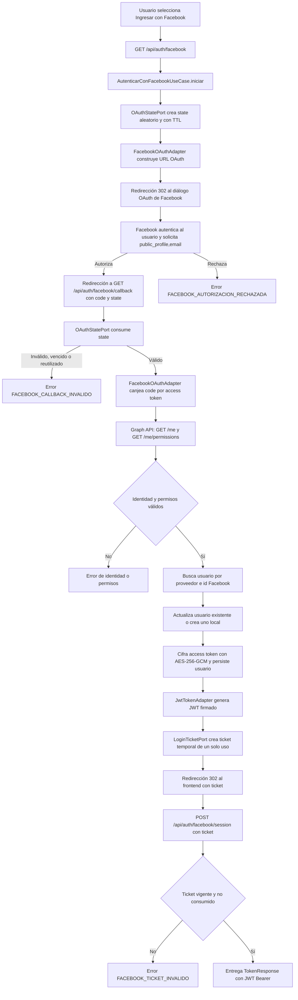

# Integración de autenticación con Facebook

## Índice

1. [Propósito y alcance](#propósito-y-alcance)
2. [Componentes utilizados](#componentes-utilizados)
3. [Flujo de validación](#flujo-de-validación)
4. [Seguridad y criptografía](#seguridad-y-criptografía)
5. [Configuración requerida](#configuración-requerida)
6. [Errores y rechazos controlados](#errores-y-rechazos-controlados)

## Propósito y alcance

La aplicación permite que un usuario se autentique mediante su cuenta de Facebook usando el flujo **OAuth 2.0 Authorization Code**. Facebook autentica al usuario y autoriza los permisos solicitados; el backend valida la respuesta, crea o actualiza el usuario local y emite el JWT propio de Andina Seguros.

La integración no acepta un token de Facebook enviado directamente por el cliente. El código de autorización se recibe solamente en el callback registrado y se intercambia desde el backend con Facebook.

## Componentes utilizados

| Componente | Capa | Responsabilidad |
| --- | --- | --- |
| `AuthController` | Adaptador de entrada REST | Expone `GET /api/auth/facebook`, `GET /api/auth/facebook/callback` y `POST /api/auth/facebook/session`. Inicia la redirección, recibe la respuesta OAuth y canjea el ticket temporal por el JWT. |
| `AutenticarConFacebookUseCase` | Caso de uso | Orquesta el inicio y callback: valida `code` y `state`, revisa permisos, busca o crea al usuario, cifra el token de Facebook y genera el JWT local. Mantiene durante 30 segundos el resultado de callbacks duplicados causados por navegador o proxy. |
| `FacebookOAuthPort` | Puerto de salida | Define el contrato independiente del proveedor: construir la URL de autorización e intercambiar el `code` por la identidad de Facebook. |
| `FacebookOAuthAdapter` | Adaptador de salida | Implementa el puerto mediante `RestClient`. Canjea el código en `/oauth/access_token`, consulta `/me` para obtener perfil y `/me/permissions` para comprobar permisos concedidos. |
| `OAuthStatePort` | Puerto de salida | Abstrae la creación y consumo del parámetro OAuth `state`. |
| `MongoDBOAuthStateAdapter` | Adaptador de salida y persistencia | Genera, guarda y consume una vez el `state` en MongoDB. Es la implementación configurada para la aplicación. |
| `InMemoryOAuthStateAdapter` | Adaptador alternativo | Ofrece el mismo mecanismo en memoria para escenarios locales o pruebas; no es el bean configurado para la aplicación. |
| `UsuarioRepository` e `Usuario` | Caso de uso y dominio | Localizan al usuario por proveedor e identificador de Facebook, crean la cuenta `facebook_{id}` cuando no existe y registran proveedor, permisos, expiración y token protegido. |
| `SecretEncryptionPort` y `AesGcmSecretEncryptionAdapter` | Puerto y adaptador de seguridad | Cifran el `access_token` de Facebook antes de persistirlo. |
| `TokenGeneratorPort` y `JwtTokenAdapter` | Puerto y adaptador de seguridad | Emiten y validan el JWT de la aplicación, con usuario y rol como claims. Este JWT no es emitido por Facebook. |
| `LoginTicketPort` e `InMemoryLoginTicketAdapter` | Puerto y adaptador de seguridad | Evitan colocar el JWT en la URL de retorno. Generan un ticket aleatorio temporal y de un solo uso para que el frontend solicite después la sesión. |
| `FacebookProperties` | Configuración | Centraliza identificador de aplicación, secreto de cliente, URLs OAuth/Graph API, scopes, TTL, URL de retorno del frontend y llave de cifrado. |

## Flujo de validación

## Seguridad y criptografía

| Mecanismo | Uso en la integración | Implementación actual |
| --- | --- | --- |
| OAuth 2.0 Authorization Code | Delegar autenticación y consentimiento a Facebook sin exponer el secreto de cliente al navegador. | El backend redirige al diálogo OAuth y canjea el `code` con `client_id`, `client_secret` y `redirect_uri`. |
| HTTPS | Confidencialidad e integridad del tráfico entre navegador, backend y Facebook. | Las URLs predeterminadas de autorización, token y Graph API usan `https://`. Las URLs configuradas en despliegue deben conservar HTTPS. |
| `state` anti-CSRF | Vincular el callback con el inicio de sesión que lo originó y bloquear callbacks forjados o repetidos. | Se generan 32 bytes mediante `SecureRandom`, se codifican Base64 URL-safe, tienen TTL configurable y se eliminan al primer consumo. |
| Validación de código y callback | Rechazar una respuesta incompleta o no asociada a una solicitud válida. | Exige un `code` no vacío y un `state` vigente consumido con éxito antes de contactar Facebook. |
| Verificación de permisos | Aplicar mínimo privilegio y asegurar que Facebook concedió permisos. | Solicita por defecto `public_profile,email` y consulta `/me/permissions`; rechaza una lista de permisos vacía. |
| AES-256-GCM | Cifrar en reposo el `access_token` de Facebook y detectar alteraciones. | Usa llave de 32 bytes (`FACEBOOK_TOKEN_ENCRYPTION_KEY`), IV aleatorio de 96 bits y etiqueta GCM de 128 bits. Se almacena `Base64(IV).Base64(ciphertext+tag)`. |
| JWT firmado con HMAC | Crear la sesión propia de la aplicación después de validar Facebook. | `JwtTokenAdapter` firma el JWT con una llave HMAC derivada de `JWT_SECRET`; contiene `sub`, `rol`, emisión y expiración. |
| Ticket temporal de un solo uso | Evitar exponer el JWT como parámetro de URL al volver al frontend. | Genera 32 bytes con `SecureRandom`, codificados en Base64 URL-safe; se elimina al canjearlo y vence según `FACEBOOK_LOGIN_TICKET_TTL_SECONDS` (300 segundos por defecto). |

Base64 y URL encoding son mecanismos de codificación, no de cifrado. Se emplean para transportar de forma segura `state`, tickets y valores de URL, pero la confidencialidad del token almacenado la proporciona AES-GCM.

## Configuración requerida

Las siguientes variables se leen desde `application.yml`; deben inyectarse como secretos del entorno y no incluirse en el repositorio:

| Variable | Finalidad |
| --- | --- |
| `FACEBOOK_APP_ID` | Identificador público de la aplicación registrada en Meta for Developers. |
| `FACEBOOK_APP_SECRET` | Credencial confidencial usada por el backend en el canje del código. |
| `FACEBOOK_REDIRECT_URI` | Callback registrado en Facebook; debe coincidir exactamente con el configurado en la plataforma. |
| `FACEBOOK_TOKEN_ENCRYPTION_KEY` | Llave Base64 que representa exactamente 32 bytes para AES-256-GCM. |
| `FACEBOOK_SCOPES` | Permisos solicitados; por defecto `public_profile,email`. |
| `FACEBOOK_OAUTH_STATE_TTL_SECONDS` | Vida máxima del `state`; por defecto 3600 segundos. |
| `FACEBOOK_LOGIN_TICKET_TTL_SECONDS` | Vida máxima del ticket de retorno; por defecto 300 segundos. |
| `FACEBOOK_FRONTEND_CALLBACK_URL` | URL del frontend a la que se redirige con el ticket temporal. |
| `JWT_SECRET` | Llave independiente para firmar los JWT propios de la aplicación. |

## Errores y rechazos controlados

| Código | Situación |
| --- | --- |
| `FACEBOOK_AUTORIZACION_RECHAZADA` | El usuario rechazó la autorización en Facebook. |
| `FACEBOOK_CALLBACK_INVALIDO` | Falta el código, el `state` es inválido, venció o ya fue consumido. |
| `FACEBOOK_IDENTIDAD_INVALIDA` | Facebook no devolvió un identificador de usuario válido. |
| `FACEBOOK_PERMISOS_INSUFICIENTES` | Facebook no reportó permisos concedidos. |
| `FACEBOOK_NO_DISPONIBLE` | Falló el intercambio OAuth o una consulta a Graph API. |
| `FACEBOOK_TOKEN_INVALIDO` | Facebook no devolvió un token utilizable para cifrar. |
| `FACEBOOK_CONFIGURACION_INVALIDA` | Faltan parámetros OAuth, la URL de retorno o la llave de cifrado no es válida. |
| `FACEBOOK_TICKET_INVALIDO` | El ticket de retorno no existe, venció o ya fue consumido. |
