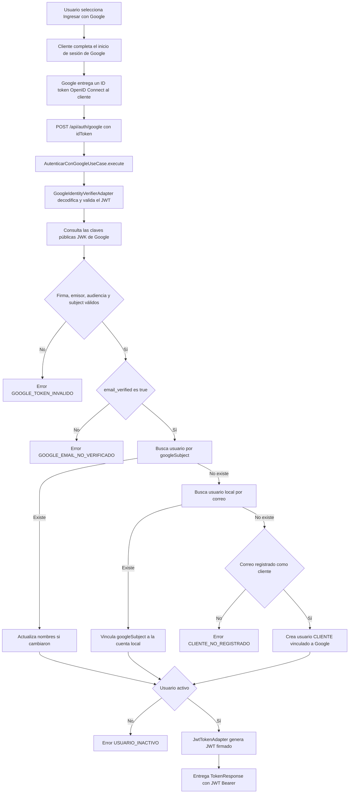

# Integración de autenticación con Google/Gmail

## Índice

1. [Propósito y alcance](#propósito-y-alcance)
2. [Componentes utilizados](#componentes-utilizados)
3. [Flujo de validación](#flujo-de-validación)
4. [Seguridad y criptografía](#seguridad-y-criptografía)
5. [Configuración requerida](#configuración-requerida)
6. [Errores y rechazos controlados](#errores-y-rechazos-controlados)

## Propósito y alcance

La aplicación permite que un usuario se autentique con una cuenta de Google, incluida una cuenta cuya dirección de correo sea Gmail. El cliente obtiene un **ID token de OpenID Connect** tras completar el inicio de sesión de Google y lo envía al backend. El backend valida criptográficamente el token, identifica al usuario y emite el JWT propio de Andina Seguros.

La integración utiliza la identidad proporcionada por Google; no accede al buzón, mensajes, contactos ni a otros datos de Gmail. Gmail sólo puede ser la dirección de correo de la cuenta con la que el usuario inicia sesión.

## Componentes utilizados

| Componente | Capa | Responsabilidad |
| --- | --- | --- |
| `AuthController` | Adaptador de entrada REST | Expone `POST /api/auth/google`. Recibe el `idToken` que el cliente obtuvo de Google y entrega el token de sesión local. |
| `AutenticarConGoogleUseCase` | Caso de uso | Orquesta la validación de identidad, comprueba que el correo esté verificado, busca o vincula al usuario local y genera el JWT propio. |
| `GoogleIdentityVerifierPort` | Puerto de salida | Define el contrato independiente de infraestructura para validar un ID token de Google y obtener su identidad. |
| `GoogleIdentityVerifierAdapter` | Adaptador de salida y seguridad | Decodifica y valida el JWT mediante las claves públicas JWK de Google; además verifica emisor, audiencia y `subject`. |
| `GoogleIdentity` | Modelo de caso de uso | Transporta el `subject`, correo, estado de verificación y datos de perfil recibidos en los claims del token. |
| `UsuarioRepository` e `Usuario` | Caso de uso y dominio | Localizan al usuario por `googleSubject` o correo. Vinculan una cuenta local existente o crean una cuenta de cliente autorizada. |
| `ClienteRepository` | Puerto de salida | Confirma que un correo sin usuario local corresponda a un cliente previamente registrado antes de crear la cuenta. |
| `TokenGeneratorPort` y `JwtTokenAdapter` | Puerto y adaptador de seguridad | Emiten el JWT de Andina Seguros con el usuario y rol como claims. Este JWT no es emitido por Google. |
| Configuración `app.google` | Configuración | Centraliza el identificador de cliente OAuth de Google y el emisor esperado del ID token. |

## Flujo de validación

## Seguridad y criptografía

| Mecanismo | Uso en la integración | Implementación actual |
| --- | --- | --- |
| OpenID Connect ID Token | Recibir una identidad autenticada por Google sin enviar una contraseña de Google al backend. | El cliente obtiene el ID token mediante el mecanismo de inicio de sesión de Google y lo envía como `idToken` a `POST /api/auth/google`. |
| Firma asimétrica y JWK | Asegurar que el token fue firmado por Google y no fue alterado. | `NimbusJwtDecoder` usa el conjunto público de claves de `https://www.googleapis.com/oauth2/v3/certs` para validar el JWT. |
| Validación de emisor | Asegurar que la identidad procede de Google. | El claim `iss` debe ser exactamente `https://accounts.google.com`. |
| Validación de audiencia | Evitar aceptar un token emitido para otra aplicación. | El claim `aud` debe contener el valor configurado en `GOOGLE_CLIENT_ID`. |
| Validación de subject | Disponer de un identificador estable y no vacío de la cuenta Google. | El claim `sub` se almacena como `googleSubject` y se utiliza como primera clave de búsqueda del usuario. |
| Correo verificado | Evitar asociar una cuenta con un correo que Google no haya confirmado. | El claim `email_verified` debe ser `true`; en caso contrario se rechaza la autenticación. |
| Vinculación controlada | Evitar crear cuentas para correos ajenos a la cartera de clientes. | Si no existe usuario por `sub` ni por correo, sólo se crea uno cuando `ClienteRepository` confirma que el correo ya está registrado como cliente. |
| JWT firmado con HMAC | Crear la sesión propia de la aplicación después de validar Google. | `JwtTokenAdapter` firma el JWT con una llave HMAC derivada de `JWT_SECRET`; contiene `sub`, `rol`, emisión y expiración. |
| HTTPS | Proteger el token en tránsito entre cliente, backend y servicios de Google. | El endpoint debe exponerse mediante HTTPS en los entornos desplegados. La URL de JWK de Google usa HTTPS. |

El ID token de Google debe tratarse como una credencial temporal. No se persiste en esta integración: se valida, se extrae la identidad necesaria y se devuelve únicamente el JWT propio de la aplicación.

## Configuración requerida

Las siguientes variables se leen desde `application.yml`; deben inyectarse como secretos o parámetros del entorno y no incluirse en el repositorio:

| Variable | Finalidad |
| --- | --- |
| `GOOGLE_CLIENT_ID` | Identificador OAuth 2.0 del cliente registrado en Google Cloud. Debe coincidir con la audiencia (`aud`) del ID token recibido. |
| `JWT_SECRET` | Llave independiente para firmar los JWT propios de la aplicación. |
| `JWT_EXPIRATION_SECONDS` | Tiempo de vigencia del JWT propio; por defecto 28800 segundos. |
| `MONGODB_URI` | Cadena de conexión de la base de datos que contiene usuarios, clientes y la vinculación `googleSubject`. |

El emisor esperado se configura como `https://accounts.google.com`. Al registrar el cliente en Google Cloud, el origen y los URI de redirección autorizados del frontend deben coincidir con la aplicación que obtiene el ID token.

## Errores y rechazos controlados

| Código | Situación |
| --- | --- |
| `GOOGLE_TOKEN_INVALIDO` | No se pudo validar el ID token: firma, emisor, audiencia o `subject` inválidos, token vencido o formato incorrecto. |
| `GOOGLE_EMAIL_NO_VERIFICADO` | El token corresponde a una cuenta cuyo correo no está verificado por Google. |
| `CLIENTE_NO_REGISTRADO` | No existe usuario local y el correo de Google no está registrado como cliente de Andina Seguros. |
| `USUARIO_INACTIVO` | La cuenta local vinculada a Google existe, pero está inactiva. |
