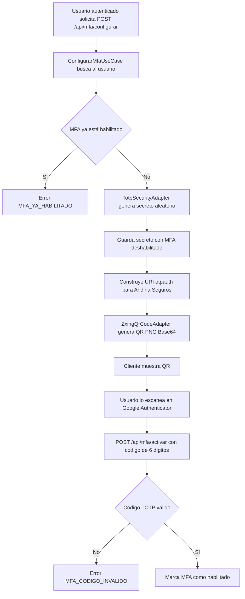
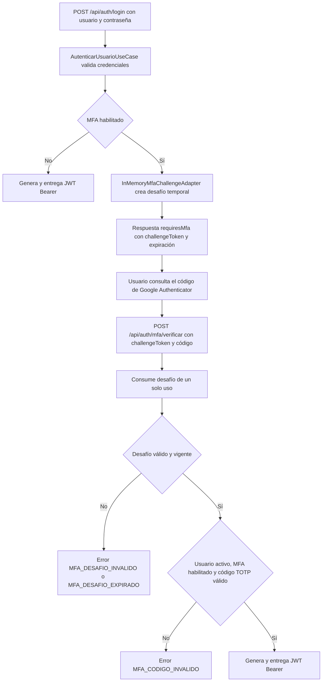

# Seguridad MFA con Google Authenticator

## Índice

1. [Propósito y alcance](#propósito-y-alcance)
2. [Componentes utilizados](#componentes-utilizados)
3. [Flujos de validación](#flujos-de-validación)
4. [Seguridad y criptografía](#seguridad-y-criptografía)
5. [Configuración requerida](#configuración-requerida)
6. [Errores y rechazos controlados](#errores-y-rechazos-controlados)

## Propósito y alcance

La aplicación implementa autenticación multifactor (MFA) mediante contraseñas de un solo uso basadas en tiempo (**TOTP**), compatibles con Google Authenticator. El usuario configura Google Authenticator escaneando un código QR generado por la aplicación y, después de activar MFA, debe ingresar un código temporal además de su contraseña local para recibir el JWT de Andina Seguros.

Google Authenticator no se conecta al backend ni transmite información a Google durante este proceso. La aplicación genera y conserva el secreto TOTP; Google Authenticator conserva una copia al escanear el QR. Ambas partes calculan localmente el mismo código temporal.

En la implementación actual, MFA se aplica al inicio de sesión local con usuario y contraseña mediante `POST /api/auth/login`. El inicio de sesión con Google en `POST /api/auth/google` emite el JWT directamente y no inicia un desafío MFA.

## Componentes utilizados

| Componente | Capa | Responsabilidad |
| --- | --- | --- |
| `MfaController` | Adaptador de entrada REST | Expone las operaciones autenticadas `POST /api/mfa/configurar`, `POST /api/mfa/activar`, `DELETE /api/mfa` y `GET /api/mfa/estado`. |
| `AuthController` | Adaptador de entrada REST | Expone `POST /api/auth/mfa/verificar` para completar el segundo factor de un inicio de sesión pendiente. |
| `ConfigurarMfaUseCase` | Caso de uso | Genera el secreto TOTP, lo asocia al usuario todavía sin habilitar MFA y construye la URI `otpauth` junto con el QR. |
| `ActivarMfaUseCase` | Caso de uso | Verifica un primer código válido de Google Authenticator antes de marcar MFA como habilitado. |
| `DesactivarMfaUseCase` | Caso de uso | Requiere un código TOTP válido antes de eliminar el secreto y deshabilitar MFA. |
| `ObtenerEstadoMfaUseCase` | Caso de uso | Devuelve si MFA está habilitado para el usuario autenticado. |
| `AutenticarUsuarioUseCase` | Caso de uso | Tras validar usuario y contraseña, crea un desafío temporal si MFA está habilitado; no emite el JWT todavía. |
| `VerificarMfaUseCase` | Caso de uso | Consume el desafío, verifica el TOTP y emite el JWT sólo cuando el segundo factor es correcto. |
| `TotpSecurityAdapter` | Adaptador de seguridad | Genera secretos Base32 y valida códigos TOTP compatibles con Google Authenticator. |
| `ZxingQrCodeAdapter` | Adaptador de seguridad | Convierte la URI `otpauth` en un QR `data:image/png;base64,...` para escanearlo desde la aplicación autenticadora. |
| `MfaChallengePort` e `InMemoryMfaChallengeAdapter` | Puerto y adaptador de seguridad | Crean y consumen, una sola vez, el token temporal que vincula contraseña validada y segundo factor. |
| `UsuarioRepository` y `Usuario` | Caso de uso y dominio | Guardan el secreto TOTP y el estado `mfaHabilitado` de cada usuario. |
| `TokenGeneratorPort` y `JwtTokenAdapter` | Puerto y adaptador de seguridad | Emiten el JWT propio después de superar satisfactoriamente ambos factores. |

## Flujos de validación

### Configuración y activación

### Inicio de sesión con MFA habilitado

## Seguridad y criptografía

| Mecanismo | Uso en la integración | Implementación actual |
| --- | --- | --- |
| TOTP RFC 6238 | Generar códigos temporales compatibles con Google Authenticator. | `TotpSecurityAdapter` calcula el código desde el secreto y el contador temporal. |
| Secreto aleatorio | Proveer una clave exclusiva por usuario para generar los códigos TOTP. | Genera 20 bytes con `SecureRandom` y los codifica en Base32. |
| HMAC-SHA1 | Derivar el código TOTP a partir del secreto y el contador de tiempo. | La URI `otpauth` declara `algorithm=SHA1`; el adaptador calcula `HmacSHA1`. |
| Códigos de 6 dígitos | Limitar el formato del segundo factor y asegurar compatibilidad con Google Authenticator. | La URI indica `digits=6`; las solicitudes REST validan el patrón `^[0-9]{6}$`. |
| Ventana de tiempo | Tolerar diferencias moderadas entre el reloj del servidor y el dispositivo. | Usa periodos de 30 segundos y valida el periodo actual, uno anterior y uno posterior. |
| URI `otpauth` y QR | Transferir el secreto al autenticador sin ingresarlo manualmente. | La URI usa el emisor `Andina Seguros` y la etiqueta del usuario; el QR se devuelve como `data:image/png;base64,...`. |
| Desafío de un solo uso | Impedir que una contraseña validada baste para reutilizar o saltar el segundo factor. | Genera 32 bytes con `SecureRandom`, codificados en Base64 URL-safe; se elimina al primer intento de consumo. |
| JWT firmado con HMAC | Entregar la sesión propia sólo después de completar el segundo factor. | `JwtTokenAdapter` firma el JWT con una llave HMAC derivada de `JWT_SECRET`; contiene usuario, rol, emisión y expiración. |
| Protección de rutas | Restringir la configuración de MFA al usuario autenticado. | Spring Security exige autenticación para `/api/mfa/**`; la verificación final está permitida en `/api/auth/mfa/verificar` porque usa el desafío temporal. |

El secreto TOTP se persiste actualmente en el atributo `mfaSecret` del usuario. La implementación no lo cifra antes de guardarlo en MongoDB; por ello debe protegerse la base de datos y se recomienda incorporar cifrado en reposo específico para ese secreto antes de un despliegue productivo de mayor exposición.

Los desafíos MFA se almacenan en memoria. Esto evita su persistencia, pero implica que se pierden al reiniciar el proceso y que, en un despliegue con múltiples instancias, la verificación debe llegar a la misma instancia que creó el desafío o migrarse a un almacén compartido.

## Configuración requerida

Las siguientes variables se leen desde `application.yml`; deben inyectarse como secretos o parámetros del entorno y no incluirse en el repositorio:

| Variable | Finalidad |
| --- | --- |
| `MFA_CHALLENGE_EXPIRATION_SECONDS` | Vida máxima del desafío posterior a la contraseña; por defecto 300 segundos. |
| `JWT_SECRET` | Llave usada para firmar el JWT de Andina Seguros tras completar MFA. |
| `JWT_EXPIRATION_SECONDS` | Tiempo de vigencia del JWT emitido después de superar MFA; por defecto 28800 segundos. |
| `MONGODB_URI` | Cadena de conexión a la base de datos que almacena el estado MFA y el secreto TOTP del usuario. |

Google Authenticator no exige credenciales ni una clave API de Google. Para que los códigos sean válidos, el reloj del servidor y el del dispositivo móvil deben estar razonablemente sincronizados.

## Errores y rechazos controlados

| Código | Situación |
| --- | --- |
| `MFA_YA_HABILITADO` | El usuario intenta generar una nueva configuración cuando MFA ya está activo. |
| `MFA_NO_CONFIGURADO` | Se intenta activar o desactivar MFA sin un secreto configurado, o se desactiva cuando ya no está habilitado. |
| `MFA_CODIGO_INVALIDO` | El código no tiene validez TOTP, el usuario está inactivo o MFA no está habilitado al verificar el desafío de inicio de sesión. |
| `MFA_DESAFIO_INVALIDO` | El `challengeToken` no existe, fue consumido anteriormente o no es válido. |
| `MFA_DESAFIO_EXPIRADO` | El desafío MFA superó el tiempo configurado de vigencia. |
| `USUARIO_NO_ENCONTRADO` | No existe el usuario al solicitar la configuración inicial de MFA. |
| `CREDENCIALES_INVALIDAS` | El usuario o contraseña iniciales no son válidos; no se crea un desafío MFA. |
