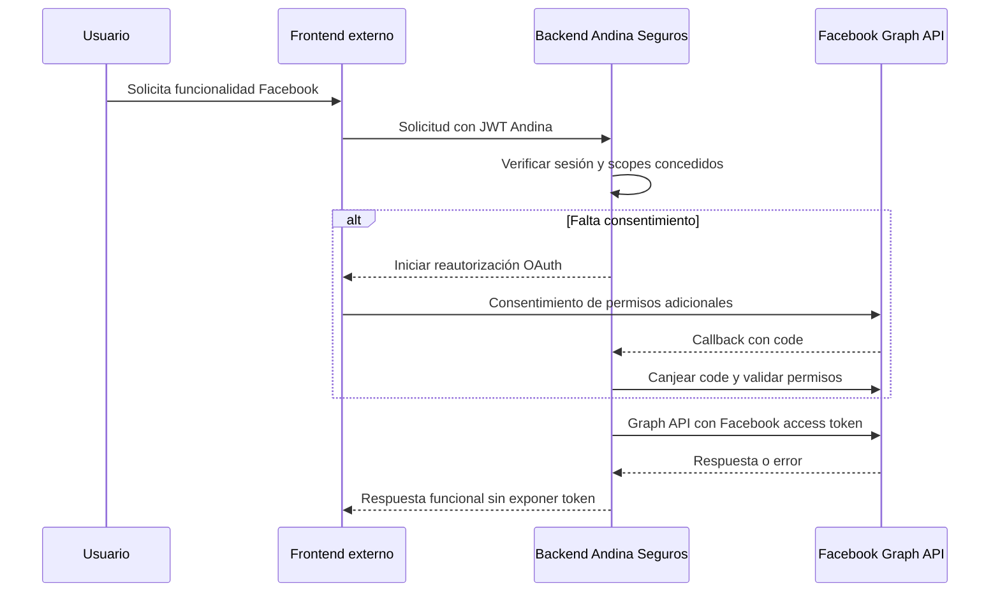

# Facebook Login

## 1. Objetivo

Incorporar Facebook Login para que una persona se autentique ante Facebook y pueda acceder a Andina Seguros con el JWT propio de la aplicación. En una etapa posterior, y solo con consentimiento para permisos concretos, el backend podrá invocar APIs de Facebook en nombre de esa persona.

El proyecto actual no define qué APIs de Facebook se consumirán. Por tanto, el login no debe interpretarse como autorización automática para cualquier Graph API.

## 2. Arquitectura actual

El repositorio es un backend monomódulo Maven en Java 21 con Spring Boot 3.3.5. Incluye Spring Web, Validation, Data MongoDB, Security, Springdoc OpenAPI y JJWT. MongoDB es la persistencia configurada y Docker Compose publica el backend en el puerto `8083` y MongoDB en `27020`.

Sigue Clean Architecture: `entities` contiene el dominio; `usecases` contiene DTOs, puertos y casos de uso; `interfaceadapters` traduce HTTP y adapta MongoDB, seguridad e integraciones externas; `frameworksdrivers` compone Spring, MongoDB y seguridad. La regla documentada es `frameworksdrivers -> interfaceadapters -> usecases -> entities`.

No hay frontend en este repositorio. La configuración CORS admite por defecto `http://localhost:5173`, que sugiere un frontend externo, pero su tecnología, rutas y manejo de sesión son **POR DEFINIR**.

La autenticación actual es local y basada en usuario/contraseña:

- `POST /api/auth/register` registra un `Usuario` con contraseña BCrypt.
- `POST /api/auth/login` autentica por `username` y contraseña y responde `TokenResponse(token, "Bearer", expiraEnSegundos)`.
- `JwtTokenAdapter` firma un JWT HMAC con `sub=username` y el claim `rol`; la duración configurable actual es `JWT_EXPIRATION_SECONDS`, por defecto 28 800 segundos.
- `JwtAuthenticationFilter` obtiene `Authorization: Bearer <jwt>`, valida el JWT, recarga el usuario por `username`, exige que esté activo y establece una autoridad `ROLE_<rol>`.
- `SecurityConfig` es stateless, deshabilita CSRF para la API actual y permite anónimamente `/api/auth/**`; lo demás requiere autenticación. La autorización por rol está habilitada mediante `@EnableMethodSecurity`, aunque su uso concreto no se determina aquí.

`Usuario` tiene `id`, `username`, `passwordHash`, `rol` y `activo`. En MongoDB, `UsuarioDocument` añade un `email` opcional; los índices únicos existentes son `username` y `email` (sparse). El repositorio solo permite buscar por `username`. No existe proveedor OAuth, configuración OAuth, endpoint callback ni token de Facebook en el código.

La integración debe reutilizar los patrones existentes: un caso de uso puro y puertos en `usecases`, adaptadores HTTP/Mongo/Facebook en `interfaceadapters`, y beans/configuración Spring en `frameworksdrivers`. El patrón de `JsonPeClient` con `RestClient`, propiedades tipadas y excepciones de integración es una referencia para un cliente de Facebook.

## 3. Arquitectura propuesta

El backend debe actuar como cliente OAuth 2.0 confidencial de Facebook. El frontend inicia el navegador hacia un endpoint del backend. Este crea y guarda un `state` de un solo uso y redirige al diálogo OAuth de Facebook. El callback debe llegar al backend, que valida `state`, intercambia el `code` con Facebook usando el App Secret exclusivamente del servidor, consulta la identidad autorizada y vincula o crea el usuario local. Solo entonces emite el JWT existente de Andina Seguros.

```mermaid
sequenceDiagram
	participant U as Usuario
	participant F as Frontend externo
	participant B as Backend Andina Seguros
	participant M as Facebook OAuth / Graph API
	U->>F: Continuar con Facebook
	F->>B: GET inicio OAuth
	B->>B: Crear state temporal, PKCE POR DEFINIR
	B-->>U: Redirigir a Facebook
	U->>M: Autenticarse y consentir permisos
	M-->>B: Callback con code y state
	B->>B: Validar state
	B->>M: Intercambiar code por access token
	B->>M: Consultar identidad y permisos concedidos
	B->>B: Vincular o crear Usuario; emitir JWT propio
	B-->>F: Redirección/respuesta de sesión POR DEFINIR
	F-->>U: Aplicación autenticada
```

No se recomienda entregar el access token de Facebook al frontend. El backend conservará el control de las llamadas a Graph API y, si se aprueba almacenarlo, lo protegerá en persistencia cifrada. La modalidad exacta de entrega del JWT propio al frontend (cuerpo JSON como el login actual, cookie HttpOnly o redirección con código de sesión de un solo uso) es **POR DEFINIR**; no se debe enviar un JWT ni access token en parámetros de URL.

## 4. Flujo de autenticación

1. **Frontend:** presenta el control "Continuar con Facebook" y navega al endpoint de inicio del backend. No necesita ni puede usar `FACEBOOK_APP_SECRET`.
2. **Backend:** genera un `state` criptográficamente aleatorio, con vencimiento corto y uso único, asociado al intento y a la URL de retorno permitida. Redirige a Facebook con `client_id`, `redirect_uri`, `response_type=code`, `state` y los permisos mínimos solicitados.
3. **Facebook y usuario:** Facebook autentica al usuario y le solicita consentimiento para los permisos requeridos. La pantalla y el resultado dependen de Facebook.
4. **Backend callback:** recibe `code` y `state`, o un error de cancelación/rechazo. Debe rechazar un state ausente, expirado, ya usado o distinto al persistido.
5. **Backend:** intercambia el `code` con Facebook mediante servidor a servidor. Valida la respuesta, consulta la identidad necesaria y verifica los permisos realmente concedidos. El App Secret no abandona el backend.
6. **Backend:** busca la vinculación por proveedor e identificador de Facebook. Si no existe, crea o vincula el usuario solo de acuerdo con la política de correo e identidad definida en la sección 14. Debe asignar un rol local por política explícita; no puede derivarlo de Facebook.
7. **Backend:** emite el JWT actual con `JwtTokenAdapter`; el cliente usa ese JWT para recursos protegidos igual que tras `POST /api/auth/login`.

El JWT de Andina Seguros autentica solicitudes contra esta API. No es un token válido para Facebook y no debe enviarse a Graph API.

## 5. Flujo de autorización para APIs

**Autenticación** responde quién es la persona y termina cuando se vincula el perfil de Facebook con un `Usuario` local y se emite el JWT propio. **Autorización de Facebook** concede permisos específicos para recursos de Facebook, y se materializa en un access token emitido por Facebook.

Cuando se defina una acción que requiere Graph API, el backend inicia o amplía el mismo flujo OAuth solicitando únicamente los scopes de esa acción. Tras el callback, registra los permisos concedidos y asocia el access token de Facebook con el usuario y la vinculación. Para invocar Graph API, el frontend llama un endpoint propio autenticado con el JWT de Andina; el caso de uso valida que la persona tenga autorización local y el adaptador de Facebook usa el access token almacenado en servidor.



Facebook no ofrece un refresh token estándar en este flujo. La estrategia para tokens de corta/larga duración, fecha de expiración y reautorización es **POR DEFINIR** y debe validarse con la documentación vigente de Meta y las APIs finalmente escogidas. Ante token inválido, expirado, permisos revocados o error de autorización, se debe marcar la vinculación como no autorizada y requerir reautorización; no se debe renovar automáticamente con datos no verificados.

## 6. Configuración de Meta

1. Crear una app de Meta para la organización y seleccionar un tipo compatible con el caso de uso **POR DEFINIR**.
2. Agregar el producto Facebook Login y registrar App ID y App Secret en el gestor de secretos del backend.
3. Configurar las Redirect URI HTTPS exactas de cada ambiente. Deben coincidir literalmente con las utilizadas por el backend.
4. Configurar los dominios de la aplicación, URL de política de privacidad, eliminación de datos y demás requisitos de publicación que Meta exija.
5. Declarar únicamente los permisos necesarios una vez estén definidas las Graph APIs. Solicitar App Review para permisos que Meta no permita en modo desarrollo o para usuarios no administradores/de prueba.
6. Configurar administradores, desarrolladores y usuarios de prueba para desarrollo; antes de producción pasar la app a modo live y completar las revisiones necesarias.

No existen App ID, App Secret, dominios, redirect URI ni permisos definidos por este repositorio; todos son **POR DEFINIR**. Nunca se registran ni incluyen credenciales reales en este documento, código fuente o logs.

## 7. Variables de entorno

Las propiedades existentes usan el prefijo `app` en YAML y variables en mayúsculas, por ejemplo `JWT_SECRET` y `CORS_ALLOWED_ORIGINS`. Al crear una configuración tipada `app.facebook`, las variables propuestas son:

| Variable | Propiedad prevista | Uso |
|---|---|---|
| `FACEBOOK_APP_ID` | `app.facebook.app-id` | Identificador público de la aplicación Meta. |
| `FACEBOOK_APP_SECRET` | `app.facebook.app-secret` | Credencial confidencial para canje de código; solo backend/gestor de secretos. |
| `FACEBOOK_REDIRECT_URI` | `app.facebook.redirect-uri` | URI exacta registrada en Meta para el callback. |
| `FACEBOOK_AUTHORIZATION_URI` | `app.facebook.authorization-uri` | Endpoint OAuth; valor final POR DEFINIR según Meta. |
| `FACEBOOK_TOKEN_URI` | `app.facebook.token-uri` | Endpoint de canje de código; valor final POR DEFINIR según Meta. |
| `FACEBOOK_GRAPH_BASE_URL` | `app.facebook.graph-base-url` | Base de Graph API; versión POR DEFINIR. |
| `FACEBOOK_SCOPES` | `app.facebook.scopes` | Permisos mínimos solicitados; la implementación inicia con `public_profile,email`. |
| `FACEBOOK_OAUTH_STATE_TTL_SECONDS` | `app.facebook.oauth-state-ttl-seconds` | Vencimiento del state; valor POR DEFINIR. |
| `FACEBOOK_TOKEN_ENCRYPTION_KEY` | `app.facebook.token-encryption-key` | Clave Base64 de 32 bytes para cifrar tokens de Facebook con AES-GCM; solo backend. |

`FACEBOOK_APP_SECRET` debe existir únicamente en backend. No se expone al frontend, JavaScript, Docker image, repositorio, respuestas HTTP ni registros. Los valores por defecto no deben incluir secretos, a diferencia de la configuración JWT actual que deberá endurecerse antes de producción.

## 8. Endpoints

Los endpoints son propuesta de diseño dentro del prefijo existente `/api/auth`; no están implementados y las URLs de retorno son **POR DEFINIR**.

| Método y URL propuesta | Autenticación | Responsabilidad | Entrada / salida |
|---|---|---|---|
| `GET /api/auth/facebook` | No | Crear state y redirigir al proveedor. | Query opcional `returnUrl` validada contra lista permitida; respuesta `302` a Facebook. |
| `GET /api/auth/facebook/callback` | No | Procesar `code`/`state`, autenticar y vincular. | Query `code`, `state` o `error`; respuesta `302` o sesión según estrategia POR DEFINIR. |
| `GET /api/auth/facebook/authorize` | JWT Andina | Iniciar solicitud incremental de permisos para una capacidad concreta. | Capacidad/scopes controlados por backend, no scopes arbitrarios del cliente; `302`. |
| `GET /api/auth/facebook/authorize/callback` | No, protegido por state | Guardar autorización adicional tras validar callback. | `code`, `state` o `error`; respuesta según experiencia de frontend POR DEFINIR. |
| `DELETE /api/auth/facebook` | JWT Andina | Desvincular localmente y eliminar/inutilizar tokens almacenados. | Sin token de Facebook en petición; `204` o error controlado. |
| `POST /api/auth/logout` | JWT Andina | Finalizar la sesión en el cliente. | `204`; el JWT stateless no se revoca en servidor. |

Errores esperados: `400` para callback/state inválido o cancelación según contrato; `401` para JWT local inválido; `403` para permisos locales/Facebook insuficientes; `502` o `503` para falla transitoria del proveedor. Los códigos y cuerpo final deben incorporarse a `GlobalExceptionHandler`, que hoy usa `ApiError`. El callback nunca debe devolver access tokens de Facebook.

## 9. Modelo de datos

El modelo vigente no puede representar identidad externa ni autorización. Para soportarla deben evolucionar `Usuario`, `UsuarioDocument`, `UsuarioMongoMapper`, `UsuarioRepository` y el repositorio Spring Data:

| Dato | Necesidad y protección |
|---|---|
| `provider` | Requerido para identificar `FACEBOOK` y permitir futuros proveedores. |
| `providerUserId` | Requerido; identificador estable retornado por Facebook. Debe tener índice único compuesto con `provider`. |
| `email` y nombre | Solo si Facebook los concede y la política lo permite; el dominio actual solo tiene `email` derivado de `username`, no nombre. |
| `passwordHash` | Debe admitir ausencia para cuentas solo Facebook, o mantenerse según política de vinculación POR DEFINIR. |
| access token Facebook | Almacenar solo si se invocarán APIs en nombre del usuario; cifrado en reposo y nunca en respuesta/log. |
| refresh token | Facebook refresh token estándar: no determinado/no asumir. |
| expiración y permisos | Necesarios si se conserva token: fecha de expiración, scopes concedidos, estado de autorización y auditoría mínima. |

No se debe enlazar una cuenta por email únicamente sin una política explícita de verificación y de prevención de toma de cuentas. La relación como campos de `Usuario` o como colección separada de identidades/autorizaciones externas es **POR DEFINIR**; una colección separada reduce la exposición de tokens y soporta varios proveedores.

## 10. Tokens y seguridad

| Activo | Emisor / uso | Ubicación |
|---|---|---|
| JWT Andina | `JwtTokenAdapter`; sesión contra el backend. | Cliente según contrato actual (`TokenResponse`); alternativa cookie HttpOnly POR DEFINIR. |
| OAuth `state` | Backend; correlación y defensa CSRF/replay. | Servidor, aleatorio, expirable y de un uso. |
| Authorization code | Facebook; canje de una sola vez. | Solo callback/backend; no persistir ni registrar. |
| Facebook access token | Facebook; llamadas Graph API autorizadas. | Solo backend, cifrado en reposo si se almacena. |

Aplicar HTTPS en desarrollo integrado/staging/producción y configurar correctamente el proxy para URLs externas. Validar estrictamente `state`, `redirect_uri`, respuesta de token, identidad y permisos concedidos. Mantener CSRF deshabilitado solo para la API Bearer actual no protege un callback OAuth: el `state` es obligatorio. Si se migrara el JWT a cookies, activar protección CSRF, `HttpOnly`, `Secure` y `SameSite` apropiado; las cookies deben permitir el retorno OAuth sin abrir CSRF indebidamente.

Restringir CORS a orígenes concretos y no usar comodines con credenciales. No registrar secretos, códigos OAuth, cabeceras `Authorization`, JWT ni access tokens. Rotar App Secret y `JWT_SECRET` mediante un gestor de secretos y procedimiento operativo. Limitar intentos, aplicar expiración corta y uso único a `state`, y eliminar tokens al desvincular o revocar. Al invalidar Facebook un token, no invalidar automáticamente el JWT de Andina salvo que la política de negocio lo indique, pero impedir llamadas posteriores a Facebook y solicitar reautorización.

## 11. Archivos a crear/modificar

Estos son los puntos reales de extensión. Los nombres de nuevas clases son propuestos para seguir los paquetes existentes y deberán confirmarse durante implementación.

| Archivo | Acción | Propósito |
|---|---|---|
| `src/main/resources/application.yml` | Modificar | Añadir propiedades `app.facebook` sin secretos por defecto. |
| `docker-compose.yml` | Modificar | Inyectar variables Facebook solo desde el entorno/gestor de secretos. |
| `src/main/java/com/andinaseguros/frameworksdrivers/configuration/spring/UseCaseConfig.java` | Modificar | Registrar puertos, casos de uso, cliente y propiedades de Facebook. |
| `src/main/java/com/andinaseguros/frameworksdrivers/configuration/spring/SecurityConfig.java` | Modificar | Permitir solo los endpoints de inicio/callback que deban ser públicos. |
| `src/main/java/com/andinaseguros/interfaceadapters/in/rest/controller/AuthController.java` | Modificar | Exponer inicio, callbacks, autorización incremental y desvinculación. |
| `src/main/java/com/andinaseguros/interfaceadapters/in/rest/exception/GlobalExceptionHandler.java` | Modificar | Mapear errores OAuth/Facebook al contrato `ApiError`, sin secretos. |
| `src/main/java/com/andinaseguros/entities/model/Usuario.java` | Modificar | Representar identidad/vinculación externa o delegarla según diseño final. |
| `src/main/java/com/andinaseguros/usecases/port/out/repository/UsuarioRepository.java` | Modificar | Buscar y persistir la vinculación por proveedor/identificador. |
| `src/main/java/com/andinaseguros/interfaceadapters/out/persistence/mongodb/document/UsuarioDocument.java` | Modificar | Persistir campos o referencia de identidad externa protegida. |
| `src/main/java/com/andinaseguros/interfaceadapters/out/persistence/mongodb/mapper/UsuarioMongoMapper.java` | Modificar | Mapear los nuevos datos sin exponer tokens. |
| `src/main/java/com/andinaseguros/interfaceadapters/out/persistence/mongodb/repository/SpringDataUsuarioMongoRepository.java` | Modificar | Añadir consultas por proveedor/identificador. |
| `src/main/java/com/andinaseguros/frameworksdrivers/configuration/persistence/MongoIndexConfiguration.java` | Modificar | Crear índice único de vinculación externa. |
| `src/main/java/com/andinaseguros/usecases/service/auth/AutenticarUsuarioUseCase.java` | Modificar o reutilizar | Extraer/reutilizar la emisión de JWT propio para login local y Facebook. |
| `src/main/java/com/andinaseguros/usecases/port/out/facebook/FacebookOAuthPort.java` | Crear | Puerto para autorización, intercambio, perfil, permisos y Graph API. |
| `src/main/java/com/andinaseguros/usecases/service/auth/AutenticarConFacebookUseCase.java` | Crear | Caso de uso de callback, vinculación y emisión de JWT. |
| `src/main/java/com/andinaseguros/usecases/service/auth/AutorizarFacebookUseCase.java` | Crear | Caso de uso para permisos posteriores, si se aprueba. |
| `src/main/java/com/andinaseguros/interfaceadapters/out/external/facebook/FacebookOAuthAdapter.java` | Crear | Adaptador `RestClient` para Meta/Facebook. |
| `src/main/java/com/andinaseguros/interfaceadapters/out/external/facebook/FacebookProperties.java` | Crear | `@ConfigurationProperties(prefix = "app.facebook")`. |
| `src/test/java/com/andinaseguros/...` | Crear/modificar | Pruebas unitarias y de adaptador de los flujos nuevos. |

No se puede identificar un archivo frontend que modificar porque no forma parte del repositorio. La clase/colección definitiva para tokens y state es **POR DEFINIR** y dependerá de la estrategia de persistencia elegida.

## 12. Plan de implementación

1. Definir Graph APIs, permisos mínimos, política de roles, vínculo de cuentas y almacenamiento/retención de tokens.
2. Crear y configurar la Meta App por ambiente, con usuarios de prueba y Redirect URI exactas.
3. Modelar la identidad externa y, si corresponde, una persistencia separada cifrada para tokens, permisos y expiración; crear índices y migración de datos necesaria.
4. Añadir puertos y casos de uso sin dependencias Spring para inicio OAuth, validación callback, vinculación, emisión del JWT existente, autorización incremental y revocación local.
5. Implementar el adaptador Facebook con `RestClient`, propiedades tipadas, timeouts y excepciones específicas; registrar beans en `UseCaseConfig`.
6. Implementar almacén de state de un uso, expiración y protección contra replay.
7. Exponer endpoints en `AuthController`, mapear errores en `GlobalExceptionHandler` y ajustar `SecurityConfig` con la mínima superficie pública.
8. Integrar el frontend externo usando redirección al backend y JWT/cookie según contrato aprobado; no incluir App Secret ni access token de Facebook.
9. Implementar llamadas Graph API únicamente para las capacidades aprobadas, siempre desde backend y con control de permisos.
10. Ejecutar pruebas, validación de CORS/HTTPS, revisión de logs y secretos en development, staging y producción; completar App Review antes de habilitar usuarios reales.

## 13. Pruebas

- Inicio OAuth genera state no predecible, expirable y de uso único; la URL de retorno no permite open redirect.
- Login exitoso: callback válido crea JWT de Andina sin revelar token Facebook.
- Usuario nuevo: se crea/vincula con rol local según política aprobada.
- Usuario existente: se reutiliza la vinculación correcta y no se duplica el usuario.
- Cancelación/rechazo de permisos: se informa un error controlado y no se crea sesión ni token.
- Callback sin `code`, con `state` inválido, expirado o repetido: es rechazado.
- Fallos en canje, token de Facebook inválido/expirado, respuesta de perfil inválida y error/red timeout Graph API: no filtran detalles sensibles y siguen el contrato de error.
- Autorización incremental: permisos no concedidos bloquean la llamada; permisos concedidos permiten solo la capacidad correspondiente.
- JWT propio: recursos protegidos aceptan el JWT emitido tras Facebook y rechazan JWT local inválido/expirado como hoy.
- Desvinculación, revocación y reautorización: eliminan/inutilizan tokens locales y obligan a consentimiento nuevo para Graph API.

## 14. Decisiones pendientes

- Graph APIs de Facebook que se consumirán y justificación de negocio: **POR DEFINIR**.
- Permisos/scopes exactos, permisos de login mínimo y necesidad de App Review: **POR DEFINIR**.
- Tipo de Meta App, versión Graph API, URLs OAuth oficiales y estrategia PKCE: **POR DEFINIR**.
- Frontend propietario, URL por ambiente, experiencia de retorno y método de entrega del JWT: **POR DEFINIR**.
- Política para cuentas existentes, coincidencia por email, cuentas locales sin contraseña y asignación de `RolUsuario`: **POR DEFINIR**.
- Modelo de persistencia de identidad/token, cifrado, retención, eliminación y acceso operativo: **POR DEFINIR**.
- Estrategia de token de Facebook de corta/larga duración, expiración, revocación y reautorización: **POR DEFINIR**.
- TTL de OAuth state, duración definitiva de la sesión JWT y comportamiento al revocar Facebook: **POR DEFINIR**.
- Dominios, Redirect URI y configuración definitiva de development, staging y producción: **POR DEFINIR**.