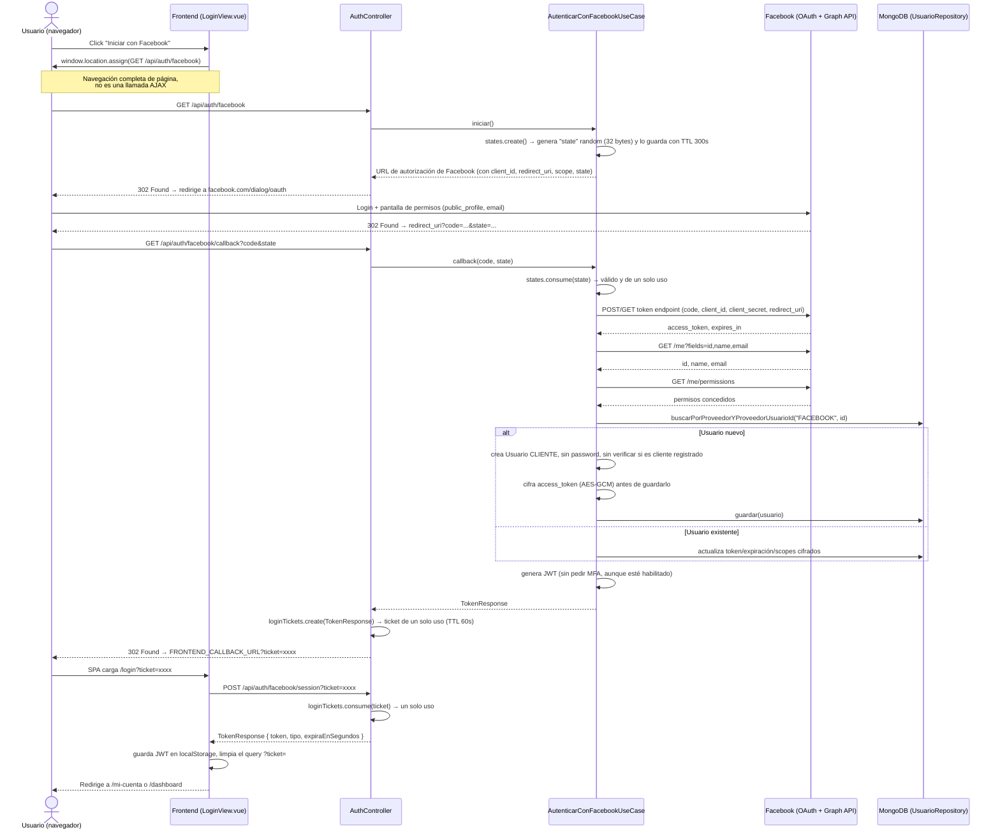
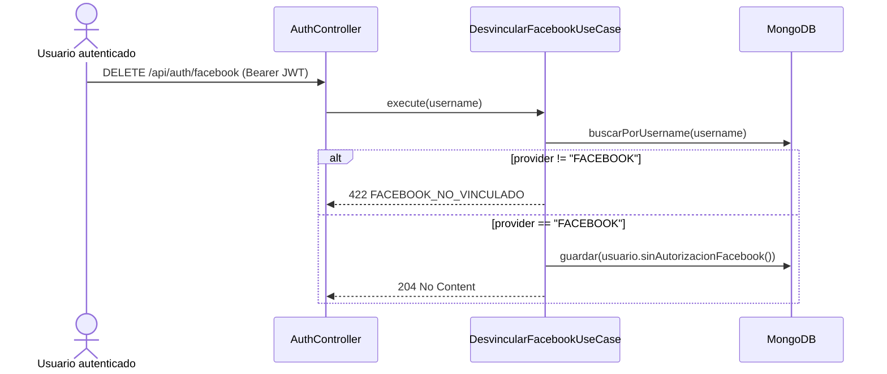

# Login con Facebook — cómo funciona hoy en el proyecto

> Analizado directamente sobre el código de `Arquitectura-Clean` (backend) y `frontend`, rama `feature/auth-social-mfa`. No se asume nada de la documentación anterior en `doc/Auth Google-MFA/`; todo lo descrito aquí se verificó leyendo los archivos fuente citados en cada sección.

## 1. Explicación en términos simples

Piensa en "Iniciar con Facebook" como usar tu carné de Facebook para entrar a Andina Seguros en vez de crear un usuario y contraseña nuevos. El flujo real es:

1. Le dices a Andina Seguros "quiero entrar con Facebook".
2. Andina Seguros te manda a la puerta de Facebook.
3. Facebook te pregunta "¿le das permiso a Andina Seguros para ver tu nombre y correo?".
4. Si dices que sí, Facebook te regresa a Andina Seguros con un "comprobante" (un código).
5. Andina Seguros, **en su propio servidor** (nunca en tu navegador), le muestra ese comprobante a Facebook y a cambio recibe tus datos básicos.
6. Con esos datos, Andina Seguros busca si ya te conoce; si no, te crea una cuenta nueva automáticamente.
7. Te entrega un "gafete" interno (un JWT) con el que ya puedes usar la aplicación.

La particularidad de este proyecto es el paso 4-5: en vez de que el navegador reciba directamente el gafete (inseguro, quedaría en el historial/URL), el backend genera un **ticket de un solo uso** y el frontend lo cambia por el gafete real con una llamada aparte.

## 2. Componentes involucrados

### Backend (`Arquitectura-Clean`)

| Capa | Archivo | Rol |
|---|---|---|
| Controller | `interfaceadapters/in/rest/controller/AuthController.java` | Expone `/api/auth/facebook`, `/api/auth/facebook/callback`, `/api/auth/facebook/session`, `DELETE /api/auth/facebook` |
| Caso de uso | `usecases/service/auth/AutenticarConFacebookUseCase.java` | Orquesta iniciar OAuth, procesar el callback, crear/actualizar el `Usuario` |
| Caso de uso | `usecases/service/auth/DesvincularFacebookUseCase.java` | Desvincula la cuenta de Facebook de un usuario ya logueado |
| Puerto (out) | `usecases/port/out/facebook/FacebookOAuthPort.java` | Contrato para hablar con Facebook |
| Puerto (out) | `usecases/port/out/facebook/OAuthStatePort.java` | Contrato para el parámetro anti-CSRF `state` |
| Puerto (out) | `usecases/port/out/security/LoginTicketPort.java` | Contrato del "ticket" de intercambio |
| Puerto (out) | `usecases/port/out/security/SecretEncryptionPort.java` | Contrato para cifrar el access token de Facebook antes de guardarlo |
| Adaptador | `interfaceadapters/out/external/facebook/FacebookOAuthAdapter.java` | Implementación real: llama a Facebook (token, `/me`, `/me/permissions`) |
| Adaptador | `interfaceadapters/out/external/facebook/InMemoryOAuthStateAdapter.java` | Guarda el `state` en memoria (mapa concurrente) con expiración |
| Adaptador | `interfaceadapters/out/security/InMemoryLoginTicketAdapter.java` | Guarda el ticket temporal en memoria |
| Adaptador | `interfaceadapters/out/external/facebook/AesGcmSecretEncryptionAdapter.java` | Cifra el access token de Facebook con AES-256-GCM |
| Config | `interfaceadapters/out/external/facebook/FacebookProperties.java` + `application.yml` (`app.facebook.*`) | Toda la configuración (app id, secret, URLs, TTLs) |
| Wiring | `frameworksdrivers/configuration/spring/UseCaseConfig.java` | Arma todos los beans anteriores |
| Modelo | `entities/model/Usuario.java` | Campos `provider`, `providerUserId`, `facebookAccessToken`, `facebookAccessTokenExpiresAt`, `facebookScopes` |

### Frontend (`frontend/src`)

| Archivo | Rol |
|---|---|
| `services/facebookAuth.ts` | Arma las URLs `/auth/facebook` y `/auth/facebook/session` |
| `views/LoginView.vue` | Botón "Iniciar con Facebook" + lógica para leer `?ticket=` o `?error=` al volver |
| `stores/auth.ts` | Acción `exchangeFacebookTicket()` que canjea el ticket por el JWT y guarda la sesión |
| `router/index.ts` | Rutas públicas/protegidas y redirección según rol |

## 3. Flujo paso a paso (con diagrama)

### 3.1 Diagrama de secuencia — camino feliz



### 3.2 Explicación técnica de cada paso

1. **Click en "Iniciar con Facebook"** (`LoginView.vue`, función `onFacebookLogin`): hace `window.location.assign(...)`, es decir, **abandona la SPA** y navega de verdad hacia el backend. Esto es necesario porque el flujo OAuth de Facebook exige redirecciones de navegador completas, no se puede hacer por `fetch`/AJAX (Facebook bloquearía el `X-Frame-Options`/CORS de su propio dominio de login).

2. **`GET /api/auth/facebook`** (`AuthController.facebook`): delega en `autenticarConFacebook.iniciar()`, que:
   - Crea un **`state`**: 32 bytes aleatorios (`SecureRandom`) codificados en Base64 URL-safe, guardado en un `ConcurrentHashMap` en memoria (`InMemoryOAuthStateAdapter`) junto a su fecha de expiración (`app.facebook.oauth-state-ttl-seconds`, por defecto 300s). El `state` es el mecanismo estándar OAuth2 para evitar **CSRF**: sin él, un atacante podría enviarle a la víctima un `code` robado.
   - Construye la URL de autorización con `client_id`, `redirect_uri`, `response_type=code`, `scope` y el `state`, todos URL-encoded.
   - Responde con **HTTP 302** apuntando a esa URL (no hace la redirección desde JavaScript, la hace el propio servidor vía el header `Location`).

3. **Facebook autentica al usuario** y muestra la pantalla de consentimiento con los permisos configurados en `app.facebook.scopes` (por defecto `public_profile,email`). El usuario puede aceptar o cancelar.

4. **Facebook redirige de vuelta** al `redirect_uri` configurado (debe coincidir exactamente, carácter por carácter, con lo registrado en el panel de desarrolladores de Facebook **y** con `FACEBOOK_REDIRECT_URI`), agregando `?code=...&state=...` si el usuario aceptó, o `?error=...` si canceló.

5. **`GET /api/auth/facebook/callback`** (`AuthController.facebookCallback`):
   - Si viene `error` (usuario canceló), el controlador lanza `ReglaNegocioException("FACEBOOK_AUTORIZACION_RECHAZADA", ...)`. **Importante:** ver la sección de inconsistencias — este camino no produce una redirección amigable al frontend.
   - Si no, llama a `autenticarConFacebook.callback(code, state)`, que hace todo el trabajo pesado:
     - **Valida el `state`**: `states.consume(state)` lo busca, comprueba que no haya expirado y **lo borra** del mapa (uso único). Si falla → `FACEBOOK_CALLBACK_INVALIDO`.
     - **Intercambia el `code` por un access token** (`FacebookOAuthAdapter.exchangeCode`): llama al `token-uri` de Facebook con `client_id`, `client_secret` (nunca sale del backend), `redirect_uri` y `code`.
     - **Pide el perfil** (`/me?fields=id,name,email`) con ese access token.
     - **Pide los permisos realmente concedidos** (`/me/permissions`) y se queda solo con los que tienen `status == "granted"` (Facebook puede reportar permisos declinados incluso si el usuario "aceptó" parcialmente).
     - Cualquier error de red o respuesta vacía en estos tres pasos se traduce en `FACEBOOK_NO_DISPONIBLE` (HTTP 503).
   - **Valida la identidad**: si no hay `id` → `FACEBOOK_IDENTIDAD_INVALIDA`; si no hay ningún scope concedido → `FACEBOOK_PERMISOS_INSUFICIENTES`.
   - **Busca al usuario** por `(provider="FACEBOOK", providerUserId=id)`:
     - Si existe → sólo actualiza el token cifrado, su expiración y los scopes (`actualizarAutorizacion`).
     - Si no existe → **crea una cuenta nueva** (`crearUsuario`): `username = "facebook_" + id`, rol `CLIENTE`, sin contraseña, sin MFA, y **cifra el access token con AES-256-GCM** (`AesGcmSecretEncryptionAdapter`) antes de guardarlo, usando la clave `FACEBOOK_TOKEN_ENCRYPTION_KEY`.
   - Verifica que el usuario esté activo (`isActivo()`), si no → `CREDENCIALES_INVALIDAS`.
   - Genera el JWT final y lo envuelve en un `TokenResponse`.
   - El controlador convierte ese `TokenResponse` en un **ticket de un solo uso** (`loginTickets.create`, TTL `app.facebook.login-ticket-ttl-seconds`, por defecto 60s) y redirige (302) al `FACEBOOK_FRONTEND_CALLBACK_URL` (por defecto `http://localhost:5173/login`) agregando `?ticket=...`.
   - **¿Por qué un ticket y no el JWT directo en la URL?** Porque cualquier cosa puesta en la URL de una redirección queda en el historial del navegador, en logs de servidores intermedios y en el header `Referer`. Un ticket de un solo uso, válido 60 segundos y que se consume inmediatamente por una llamada `POST` (no visible en el historial), reduce mucho esa superficie de exposición.

6. **La SPA vuelve a cargar** en `/login?ticket=xxxx`. El `onMounted` de `LoginView.vue` detecta el `ticket` en la query y llama a `exchangeFacebookTicket`.

7. **`POST /api/auth/facebook/session?ticket=xxxx`** (`AuthController.facebookSession`): llama a `loginTickets.consume(ticket)`, que lo busca, verifica que no haya expirado y **lo elimina** (uso único). Si el ticket no existe o expiró → `FACEBOOK_TICKET_INVALIDO`. Si es válido, devuelve el `TokenResponse` guardado en el paso 5.

8. **El frontend guarda la sesión** (`stores/auth.ts` → `setSession`): decodifica el JWT en el navegador **solo para leer el claim `rol`/`sub`** y decidir a dónde navegar — esto **no es una verificación de firma**, es únicamente para la UI. La seguridad real la garantiza el backend: cada llamada posterior enviará el JWT en `Authorization: Bearer ...` y el `JwtAuthenticationFilter` validará la firma y volverá a comprobar en base de datos que el usuario siga activo. Luego limpia el `?ticket=` de la URL (para que no quede reutilizable/visible) y navega a `/mi-cuenta` o `/dashboard` según el rol.

### 3.3 Desvincular Facebook (`DELETE /api/auth/facebook`)



Este endpoint existe en el backend y está protegido por `@PreAuthorize("isAuthenticated()")`, pero **no hay ningún botón ni llamada en el frontend que lo use** (ver inconsistencias).

## 4. Configuración necesaria

Todo vive bajo `app.facebook.*` en `application.yml`, resuelto desde variables de entorno:

| Variable | Uso | Valor por defecto |
|---|---|---|
| `FACEBOOK_APP_ID` | `client_id` en la URL de autorización y en el intercambio de token | *(vacío)* |
| `FACEBOOK_APP_SECRET` | `client_secret`, sólo se usa server-side | *(vacío)* |
| `FACEBOOK_REDIRECT_URI` | Debe ser exactamente `https://tu-backend/api/auth/facebook/callback` y estar registrada en Meta for Developers | *(vacío)* |
| `FACEBOOK_AUTHORIZATION_URI` | Endpoint de autorización de Facebook | `https://www.facebook.com/v22.0/dialog/oauth` |
| `FACEBOOK_TOKEN_URI` | Endpoint de intercambio de token | `https://graph.facebook.com/v22.0/oauth/access_token` |
| `FACEBOOK_GRAPH_BASE_URL` | Base para `/me` y `/me/permissions` | `https://graph.facebook.com/v22.0` |
| `FACEBOOK_SCOPES` | Permisos solicitados | `public_profile,email` |
| `FACEBOOK_OAUTH_STATE_TTL_SECONDS` | Vigencia del `state` anti-CSRF | `300` |
| `FACEBOOK_FRONTEND_CALLBACK_URL` | A dónde se redirige la SPA con el `?ticket=` | `http://localhost:5173/login` |
| `FACEBOOK_LOGIN_TICKET_TTL_SECONDS` | Vigencia del ticket de intercambio | `60` |
| `FACEBOOK_TOKEN_ENCRYPTION_KEY` | Clave AES-256 (Base64, 32 bytes decodificados) para cifrar el access token guardado | *(vacío → falla al primer login real)* |

Si falta cualquiera de `appId/appSecret/redirectUri/authorizationUri/tokenUri/graphBaseUrl`, `FacebookOAuthAdapter.requireConfiguration()` lanza `FACEBOOK_CONFIGURACION_INVALIDA` **antes** de llamar a Facebook — esto sí está bien resuelto.

## 5. Códigos de error y su HTTP status

| Código | HTTP | Origen | Cuándo ocurre |
|---|---|---|---|
| `FACEBOOK_AUTORIZACION_RECHAZADA` | 400 | `AuthController` | El usuario canceló el consentimiento en Facebook |
| `FACEBOOK_CALLBACK_INVALIDO` | 400 | `AutenticarConFacebookUseCase` | Falta `code`, o el `state` no existe/expiró/ya se usó |
| `FACEBOOK_NO_DISPONIBLE` | 503 | `FacebookOAuthAdapter` | Error de red o respuesta inválida de Facebook |
| `FACEBOOK_IDENTIDAD_INVALIDA` | 422 | `AutenticarConFacebookUseCase` | Facebook no devolvió un `id` |
| `FACEBOOK_PERMISOS_INSUFICIENTES` | 422 | `AutenticarConFacebookUseCase` | Ningún permiso quedó en estado `granted` |
| `USUARIO_DUPLICADO` | 409 | `AutenticarConFacebookUseCase` | Colisión de username `facebook_<id>` (prácticamente no ocurre) |
| `VINCULACION_REQUIERE_CONFIRMACION` | 409 | `AutenticarConFacebookUseCase` | El email de Facebook coincide con el *username* de otra cuenta |
| `CREDENCIALES_INVALIDAS` | 401 | `AutenticarConFacebookUseCase` | El usuario encontrado/creado está inactivo |
| `FACEBOOK_TICKET_INVALIDO` | 422 | `AuthController` / `LoginTicketPort` | El ticket no existe, expiró o ya se canjeó |
| `FACEBOOK_CONFIGURACION_INVALIDA` | 422 | `FacebookOAuthAdapter` / `AesGcmSecretEncryptionAdapter` | Falta configuración de Facebook o la clave de cifrado |
| `FACEBOOK_TOKEN_INVALIDO` | 422 | `AesGcmSecretEncryptionAdapter` | Facebook devolvió un access token vacío |
| `FACEBOOK_NO_VINCULADO` | 422 | `DesvincularFacebookUseCase` | Se intenta desvincular una cuenta que no vino de Facebook |

## 6. Inconsistencias y posibles errores detectados

### ✅ Bugs reales encontrados y corregidos (verificados en pruebas en vivo, 2026-09-09)

Estos tres no se habían detectado en la lectura estática del código — aparecieron al ejecutar el flujo completo contra un app real de Facebook ("SegurosFc") y quedaron corregidos en el código actual:

**A. Doble codificación de URL rompía el intercambio del `code`.** `FacebookOAuthAdapter.exchangeCode` armaba las URLs hacia Facebook codificando manualmente cada parámetro con `URLEncoder.encode(...)` y concatenando todo en un `String`, que luego se pasaba a `RestClient.get().uri(String)`. Spring interpreta ese `String` como una plantilla de URI y **vuelve a procesarla**, corrompiendo el `redirect_uri` que ya venía codificado. Facebook respondía con `400 Bad Request` y el mensaje `"redirect_uri isn't an absolute URI. Check RFC 3986."` (código de error 191), que el adaptador convertía en el genérico `FACEBOOK_NO_DISPONIBLE` sin loguear la causa real. El primer salto a Facebook (`authorizationUrl`, que usa `URI.create()` directo desde el controlador) nunca tuvo este problema porque no pasa por el mismo mecanismo de Spring.
**Corrección:** las tres llamadas de `exchangeCode` (token, `/me`, `/me/permissions`) ahora se construyen con `UriComponentsBuilder` (una sola codificación) y se le entrega a `RestClient` un `URI` ya construido, que se usa tal cual sin volver a tocarlo.

**B. El Graph API de Facebook responde con `Content-Type: text/javascript` en vez de `application/json`.** Es un comportamiento heredado (soporte histórico a JSONP) de algunos endpoints del Graph API. El `RestClient` por defecto solo tiene registrado el conversor Jackson para `application/json`, así que rechazaba un cuerpo que en realidad sí era JSON válido, con `UnknownContentTypeException`.
**Corrección:** en `UseCaseConfig.facebookOAuthPort`, el `RestClient` de Facebook ahora registra `text/javascript` como tipo de contenido adicional aceptado por el conversor JSON.

**C. El correo no se sincronizaba en logins posteriores de un usuario ya existente.** `actualizarAutorizacion` (la rama que se ejecuta cuando el usuario de Facebook ya existe) solo actualizaba el access token, su expiración y los scopes — nunca el `email`. Esto significa que si alguien inició sesión la primera vez sin el permiso `email` concedido (por ejemplo, mientras el scope no incluía `email`, o mientras Facebook aún no tenía ese permiso agregado en el panel) y luego sí lo concedía en un login posterior, el correo capturado en ese segundo intento **se descartaba silenciosamente**.
**Corrección:** se agregó `Usuario.conEmail(String email)` y `actualizarAutorizacion` ahora actualiza el correo del usuario existente cuando Facebook lo entrega, en lugar de conservar solo el capturado en el registro original.

**Nota operativa (no es un bug de código):** además de estos tres bugs, para que Facebook conceda el permiso `email` hace falta **agregarlo explícitamente** en el panel de Meta for Developers (App Review → Permissions and Features → "Agregar" sobre `email`), incluso para cuentas Administrador/Desarrollador de la app en modo pruebas. Sin ese paso, Facebook rechaza la solicitud con `Invalid Scopes: email` antes de siquiera llegar al backend.

### 🔴 Alta severidad

**1. El login con Facebook nunca exige el segundo factor (MFA), aunque el usuario lo tenga activado.**
`AutenticarConFacebookUseCase.callback` genera el JWT directamente (línea con `tokens.generar(...)`) sin llamar en ningún momento a `MfaChallengePort` ni comprobar `usuario.isMfaHabilitado()`. Compárese con `AutenticarUsuarioUseCase.execute` (login con contraseña), que sí hace:
```java
if (usuario.isMfaHabilitado()) {
    var challenge = mfaChallenges.crear(identity);
    return ResultadoLogin.requiereMfa(...);
}
```
**Impacto:** un usuario que activó MFA para "estar más protegido" queda completamente desprotegido si su cuenta tiene Facebook vinculado — cualquiera que controle esa sesión de Facebook entra sin el segundo factor. Ver también [MFA.md](./MFA.md#inconsistencia-cruzada-el-mfa-no-es-realmente-obligatorio).

**2. El login con Facebook no verifica que la persona sea un cliente registrado de Andina Seguros — el login con Google sí.**
En `AutenticarConGoogleUseCase.vincularOCrearUsuario`, antes de crear una cuenta nueva se exige:
```java
if (clientes.buscarPorCorreo(identidad.email()).isEmpty()) {
    throw clienteNoRegistrado();
}
```
`AutenticarConFacebookUseCase` **no tiene ninguna dependencia de `ClienteRepository`** (no se inyecta en su constructor) y su método `crearUsuario` da de alta una cuenta `CLIENTE` para **cualquier persona con una cuenta de Facebook**, sin ninguna validación de negocio. Esto está confirmado también por el test `FacebookLoginUseCaseScenariosTest.usuarioNuevoConTokenValidoSeRegistraYCreaJwt`, que registra un usuario nuevo sin mockear (ni necesitar) ningún `ClienteRepository`.
**Impacto:** cualquier persona externa puede autoregistrarse como cliente de la aseguradora usando solo su cuenta de Facebook, evadiendo la regla de negocio "solo clientes registrados pueden tener acceso" que sí se aplica en el flujo de Google.

**3. Cuando Facebook rechaza/cancela el login, el usuario ve un JSON crudo del backend en vez de volver a la app.**
`AuthController.facebookCallback` recibe la petición como una **navegación completa del navegador** (no es AJAX). Si `error != null`, lanza la excepción directamente desde ese mismo endpoint; el `GlobalExceptionHandler` la convierte en un cuerpo JSON con status 400 — y ese JSON es lo que el navegador termina mostrando como página completa, porque nunca hubo una redirección de vuelta al frontend.
Como evidencia adicional, `LoginView.vue` tiene código para manejar este caso (`if(ruta.query.error){...}`), pero **nada en el backend redirige alguna vez a `.../login?error=...`** — ese código del frontend es efectivamente inalcanzable con la implementación actual.
**Impacto:** mala experiencia de usuario (pantalla de error técnica en vez de un mensaje amigable) y código frontend muerto que da una falsa sensación de que el caso está cubierto.

### 🟠 Severidad media

**4. Desvincular Facebook puede dejar una cuenta sin ninguna forma de volver a entrar.**
`DesvincularFacebookUseCase.execute` solo comprueba que `provider == "FACEBOOK"`; no valida que el usuario tenga contraseña (`passwordHash != null`) ni una cuenta de Google vinculada (`googleSubject != null`) antes de borrar el vínculo. Una cuenta creada **solo** vía Facebook (sin password, sin Google) queda, tras desvincularse, sin ningún método de autenticación disponible — y el proyecto no tiene un flujo de "recuperar contraseña" visible.
**Impacto:** bloqueo permanente de la cuenta por una acción que el propio usuario ejecuta pensando que es reversible.

**5. El mensaje `VINCULACION_REQUIERE_CONFIRMACION` promete un flujo que no existe.**
Se lanza cuando el email de Facebook coincide con el *username* de otro usuario, pero no hay ningún endpoint ni caso de uso en el código que permita "confirmar" esa vinculación. El usuario queda en un callejón sin salida.

**6. No hay UI para el endpoint de desvinculación.**
`DELETE /api/auth/facebook` existe y está protegido correctamente, pero ninguna vista de `frontend/src` lo invoca (búsqueda confirmada: no hay referencias a `desvincular`/`unlink`/`DELETE.*facebook` en el código Vue). Es una funcionalidad de backend inalcanzable para el usuario final.

**7. Artefactos de build commiteados al repositorio.**
`frontend/src/services/facebookAuth.js` es una copia compilada (sin tipos) de `facebookAuth.ts`, y `frontend/src/views/*.vue.js` son salidas de depuración del *type-checker* de Vue (Volar/`vue-tsc`, se nota por el marcador `debugger; /* PartiallyEnd: #3632/scriptSetup.vue */` y las variables `__VLS_*`). Ninguno está en `.gitignore` (que solo excluye `node_modules` y `dist`). Riesgo: quedan desactualizados respecto al `.ts`/`.vue` real y confunden a quien navegue el repo pensando que son código fuente vivo.

### 🟡 Severidad baja / notas de diseño

**8. Taxonomía de errores inconsistente con Google.** Un usuario inactivo detectado en el flujo de Facebook responde `CREDENCIALES_INVALIDAS` (401), mientras que el mismo caso en Google responde `USUARIO_INACTIVO` (401). Incluso resultando en el mismo status HTTP, el frontend (`messagesByCode` en `services/api.ts`) sólo tiene traducido `USUARIO_INACTIVO`; si el mensaje `mensaje` del backend faltara alguna vez, `CREDENCIALES_INVALIDAS` se mostraría con un texto distinto ("usuario o contraseña incorrectos") para una situación que no tiene nada que ver con la contraseña.

**9. El estado OAuth, el ticket de login y el desafío MFA viven todos en `ConcurrentHashMap`s en memoria del proceso** (`InMemoryOAuthStateAdapter`, `InMemoryLoginTicketAdapter`). Esto funciona perfecto en un solo proceso, pero: (a) un reinicio del backend invalida todo login de Facebook en curso, y (b) si algún día se despliega con más de una instancia detrás de un balanceador, el callback o el canje de ticket pueden caer en una instancia distinta a la que generó el `state`/ticket, produciendo errores intermitentes `FACEBOOK_CALLBACK_INVALIDO` / `FACEBOOK_TICKET_INVALIDO` que no tienen que ver con el usuario.

**10. `FACEBOOK_TOKEN_ENCRYPTION_KEY` sin valor por defecto.** Si no se configura, el fallo no aparece al arrancar la aplicación sino recién en el primer login real de Facebook (al intentar cifrar el access token), con el código `FACEBOOK_CONFIGURACION_INVALIDA`. Sería más fácil de operar si se validara al arrancar (fail-fast), igual que ya se hace para el resto de la config de Facebook en `requireConfiguration()`.

## 7. Recomendaciones (resumen)

- Decidir explícitamente si el login social debe respetar MFA y, si sí, enrutar también Google/Facebook a través de `MfaChallengePort` cuando `usuario.isMfaHabilitado()`.
- Igualar la regla de "solo clientes registrados" entre Google y Facebook, o documentar explícitamente por qué Facebook es distinto (por ejemplo, si es un canal de auto-registro intencional, dejarlo dicho en el código/comentario y en el análisis de riesgo).
- Hacer que `/api/auth/facebook/callback` redirija siempre al frontend (incluso en error), con un parámetro tipo `?error=facebook_rechazado`, para que el manejo ya existente en `LoginView.vue` deje de ser código muerto.
- Antes de permitir desvincular Facebook, exigir que el usuario tenga otro método de acceso (password u otro proveedor), o bloquear la operación con un mensaje claro.
- Quitar del repositorio los `.vue.js` generados y `facebookAuth.js`, y agregar `*.vue.js` al `.gitignore`.
- Validar `FACEBOOK_TOKEN_ENCRYPTION_KEY` al arrancar la aplicación, no en el primer uso.

---
Ver también: [LOGIN-GOOGLE.md](./LOGIN-GOOGLE.md) · [MFA.md](./MFA.md)
