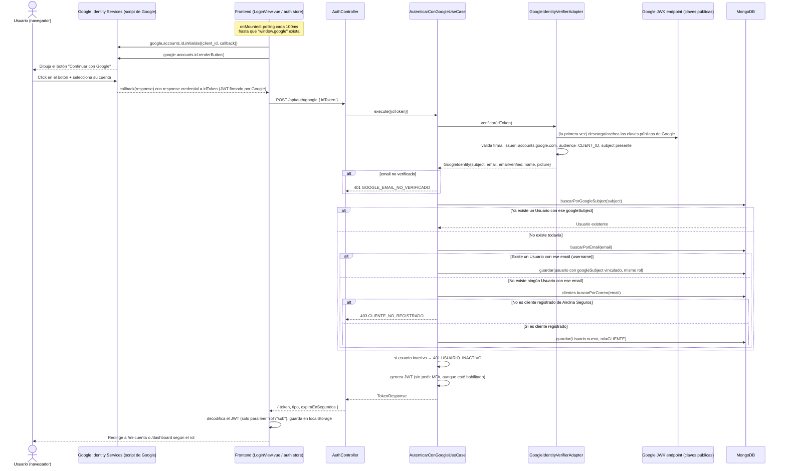

# Login con Google — cómo funciona hoy en el proyecto

> Analizado directamente sobre el código de `Arquitectura-Clean` (backend) y `frontend`, rama `feature/auth-social-mfa`.

## 1. Explicación en términos simples

El login con Google en este proyecto es **distinto en su mecánica** al de Facebook: no hay redirecciones de página completa ni "código de un solo uso". Google usa un método llamado **"Sign In With Google" (GIS - Google Identity Services)**: un botón que Google renderiza dentro de la misma página, que al hacer clic le entrega directamente al navegador un **token firmado por Google (un JWT llamado `idToken`)** que ya contiene el nombre, correo y si ese correo está verificado. El navegador se lo pasa a nuestro backend, y el backend **verifica la firma matemáticamente** (sin llamar a Google en cada login) para confiar en esos datos.

Es como si Google te diera una credencial sellada y timbrada al momento, y nuestro backend solo necesita comprobar el sello — no necesita llamar por teléfono a Google para confirmar que es válida.

## 2. Componentes involucrados

### Backend (`Arquitectura-Clean`)

| Capa | Archivo | Rol |
|---|---|---|
| Controller | `interfaceadapters/in/rest/controller/AuthController.java` | Expone `POST /api/auth/google` |
| Request DTO | `interfaceadapters/in/rest/request/GoogleLoginRequest.java` | `{ idToken }` |
| Caso de uso | `usecases/service/auth/AutenticarConGoogleUseCase.java` | Verifica el token, busca/crea/vincula el `Usuario`, emite el JWT |
| Puerto (out) | `usecases/port/out/security/GoogleIdentityVerifierPort.java` | Contrato de verificación |
| Modelo de puerto | `usecases/port/out/security/GoogleIdentity.java` | `subject, email, emailVerified, name, picture` |
| Adaptador | `interfaceadapters/out/security/google/GoogleIdentityVerifierAdapter.java` | Implementación real con Spring Security OAuth2 JOSE (`NimbusJwtDecoder`) |
| Wiring | `frameworksdrivers/configuration/spring/UseCaseConfig.java` | Construye el `JwtDecoder` apuntando al JWK set público de Google |
| Modelo | `entities/model/Usuario.java` | Campo `googleSubject` |
| Repositorio | `usecases/port/out/repository/UsuarioRepository.java` / `ClienteRepository.java` | `buscarPorGoogleSubject`, `buscarPorEmail`, `buscarPorCorreo` (clientes) |

### Frontend (`frontend/src`)

| Archivo | Rol |
|---|---|
| `views/LoginView.vue` | Carga el script de Google, inicializa el botón, recibe el `credential` |
| `stores/auth.ts` | Acción `loginWithGoogle(idToken)` → `POST /auth/google` |
| Variable de entorno `VITE_GOOGLE_CLIENT_ID` | Client ID público usado por el botón de Google en el navegador |

## 3. Flujo paso a paso (con diagrama)

### 3.1 Diagrama de secuencia

### 3.2 Explicación técnica de cada paso

1. **Carga del botón de Google** (`LoginView.vue`, segundo `onMounted`): como el script `https://accounts.google.com/gsi/client` se carga aparte (típicamente vía un `<script>` en `index.html`), el componente hace **polling cada 100ms hasta 50 intentos** (~5 segundos) esperando a que `window.google` exista. Si aparece, llama a `google.accounts.id.initialize({client_id, callback: onGoogleCredential})` y luego `renderButton` para dibujar el botón dentro de `#google-btn`. Si no aparece en 5 segundos, deja de intentar (sin mostrar ningún mensaje de error al usuario).

2. **El usuario hace clic y elige su cuenta de Google**. Todo esto ocurre **dentro del iframe/popup que controla Google**, nuestro frontend nunca ve la contraseña de Google ni participa en esa autenticación.

3. **Google invoca el `callback`** que registramos, entregando un objeto con `response.credential`: este es el **`idToken`**, un JWT firmado por Google que contiene (entre otros) los claims `iss` (quién lo emitió), `aud` (para qué aplicación es, nuestro `client_id`), `sub` (identificador único e inmutable de la cuenta de Google), `email`, `email_verified` y `name`.

4. **El frontend llama a `authStore.loginWithGoogle(idToken)`**, que hace `POST /api/auth/google { idToken }` sin ninguna otra información — todo lo necesario ya está dentro del token firmado.

5. **`AutenticarConGoogleUseCase.execute`**:
   - **Verifica el token** (`GoogleIdentityVerifierAdapter.verificar`): usa un `NimbusJwtDecoder` de Spring Security configurado con el **JWK set público de Google** (`https://www.googleapis.com/oauth2/v3/certs`), que valida criptográficamente que el JWT fue firmado por Google y no ha sido alterado, y que no está expirado (esto lo hace `NimbusJwtDecoder` internamente). Encima de esa verificación estándar, el adaptador agrega tres chequeos manuales:
     - `iss` debe ser exactamente `https://accounts.google.com` (evita tokens de otro emisor).
     - `aud` debe contener nuestro `GOOGLE_CLIENT_ID` (evita que un `idToken` emitido para **otra** aplicación de Google sea reutilizado aquí — este es el chequeo de *audiencia*, crítico en OAuth).
     - `sub` (subject) no puede estar vacío.
   - Si algo fallara en la verificación (firma inválida, expirado, issuer/audiencia incorrectos), se captura como `RuntimeException` genérica y se traduce a `GOOGLE_TOKEN_INVALIDO` (401) — el detalle técnico exacto del fallo no se expone al cliente, solo se loguea internamente (buena práctica).
   - **Exige `email_verified = true`**: si Google reporta el correo como no verificado, se rechaza con `GOOGLE_EMAIL_NO_VERIFICADO` — esto evita que alguien inicie sesión con un correo que ni el propio Google confirma que le pertenece.
   - **Busca al usuario por `googleSubject`** (el identificador **estable** de Google, nunca cambia aunque la persona cambie su email). Si ya existe, se usa directamente.
   - Si no existe, intenta **vincular por correo** (`vincularOCrearUsuario`):
     - Si ya hay un `Usuario` (de cualquier origen) cuyo campo `email` coincide, se **vincula automáticamente** ese `googleSubject` a esa cuenta existente, **conservando su rol actual** (`vincularGoogleAUsuarioExistente`) — sin pedir contraseña ni ninguna confirmación adicional, solo confiando en que Google verificó ese correo.
     - Si no hay ningún `Usuario` con ese correo, se consulta `ClienteRepository.buscarPorCorreo(email)`: **solo si la persona ya es cliente registrado de Andina Seguros** se le crea una cuenta nueva (`RolUsuario.CLIENTE`, activa, sin password, sin MFA). Si no es cliente, se rechaza con `CLIENTE_NO_REGISTRADO` (403) y un mensaje que la invita a contactar a un agente.
   - Verifica que la cuenta esté activa (`USUARIO_INACTIVO`, 401 si no).
   - Genera el JWT y responde con `TokenResponse`.

6. **El frontend guarda la sesión** igual que en los demás flujos: decodifica el JWT solo para leer claims de UI (`rol`, `sub`), persiste en `localStorage`, y navega según el rol.

## 4. Configuración necesaria

| Variable | Uso | Notas |
|---|---|---|
| `GOOGLE_CLIENT_ID` (backend, `app.google.client-id`) | Validar el claim `aud` del `idToken` | Sin valor por defecto útil (`""`), ver inconsistencia #2 |
| `app.google.issuer` | Validar el claim `iss` | Fijo: `https://accounts.google.com` |
| `VITE_GOOGLE_CLIENT_ID` (frontend) | Se pasa a `google.accounts.id.initialize` | Debe ser **el mismo** Client ID que `GOOGLE_CLIENT_ID` del backend; si no coinciden, todo login fallará por audiencia inválida |

A diferencia de Facebook, **no hace falta ningún secreto de servidor** (`client_secret`) para este flujo, porque Google verifica la identidad del lado del cliente con el `idToken` firmado y el backend solo valida la firma — no hay intercambio de `code` por token en este camino.

## 5. Códigos de error y su HTTP status

| Código | HTTP | Cuándo ocurre |
|---|---|---|
| `GOOGLE_TOKEN_INVALIDO` | 401 | Firma inválida, expirado, `iss`/`aud` incorrectos, o cualquier error inesperado al decodificar |
| `GOOGLE_EMAIL_NO_VERIFICADO` | 401 | `email_verified` es `false` en el token de Google |
| `CLIENTE_NO_REGISTRADO` | 403 | El correo de Google no corresponde a ningún cliente de Andina Seguros |
| `USUARIO_INACTIVO` | 401 | El usuario encontrado/vinculado/creado está desactivado |

## 6. Inconsistencias y posibles errores detectados

### 🔴 Alta severidad

**1. El login con Google nunca exige el segundo factor (MFA), aunque el usuario lo tenga activado.**
Igual que en Facebook: `AutenticarConGoogleUseCase.execute` genera el JWT de forma directa, sin pasar por `MfaChallengePort` ni comprobar `usuario.isMfaHabilitado()`. Un usuario que activó MFA (`/seguridad`) y **también** tiene su cuenta vinculada a Google puede saltarse por completo el segundo factor iniciando sesión con Google en vez de usuario/contraseña. Ver [MFA.md](./MFA.md#inconsistencia-cruzada-el-mfa-no-es-realmente-obligatorio).

**2. La vinculación automática por correo no distingue roles ni pide confirmación.**
`vincularGoogleAUsuarioExistente` vincula el `googleSubject` a **cualquier** `Usuario` existente que comparta el campo `email`, sin importar su rol (`ADMIN`, `AGENTE`, `ACTUARIO` o `CLIENTE`) y sin ningún paso de confirmación (por ejemplo, un correo de verificación o exigir la contraseña actual una vez). Hoy esto es de **bajo riesgo práctico** porque:
   - `RegistrarUsuarioUseCase` (alta manual de `ADMIN`/`AGENTE`/`ACTUARIO`, ver `CrearUsuarioRequest`) **no captura correo** — esas cuentas nacen siempre con `email = null`.
   - El único mecanismo que sí rellena el campo `email` es, precisamente, un login social previo (Google o Facebook), y ambos fuerzan el rol `CLIENTE` al crear.

   Es decir, hoy en la práctica esta vía solo puede vincular cuentas `CLIENTE` entre sí. **Pero la regla no está garantizada por el código de este caso de uso**, sino que depende de que ninguna otra parte del sistema llegue a asignarle un `email` a una cuenta de staff. Si en el futuro se agrega, por ejemplo, un "editar mi perfil" que permita a un `ADMIN` guardar su correo corporativo, este mismo flujo de Google quedaría automáticamente habilitado para tomar sesión en esa cuenta administrativa sin pedir contraseña, apoyándose únicamente en que el correo de Google coincida. Se recomienda que `AutenticarConGoogleUseCase` **restrinja explícitamente** la vinculación automática a `RolUsuario.CLIENTE`, en vez de depender de que ninguna otra funcionalidad rompa esa invariante implícita.

### 🟠 Severidad media

**3. Configuración faltante de Google falla de forma silenciosa y confusa, a diferencia de Facebook.**
`FacebookOAuthAdapter` tiene un método explícito `requireConfiguration()` que revisa que ningún campo esté vacío y lanza `FACEBOOK_CONFIGURACION_INVALIDA` con un mensaje claro. El adaptador de Google **no tiene un chequeo equivalente**: si `GOOGLE_CLIENT_ID` queda vacío (el `application.yml` lo define como `${GOOGLE_CLIENT_ID:}`, es decir, por defecto cadena vacía, así que la app **arranca sin error**), cualquier intento de login con Google fallará silenciosamente con `GOOGLE_TOKEN_INVALIDO` — un mensaje genérico de "token inválido" que no ayuda a diagnosticar que en realidad **falta configurar el Client ID en el servidor**.

**4. Ningún control de que el `idToken` sea reciente / de un solo uso.**
`GoogleIdentityVerifierAdapter` valida firma, `iss`, `aud` y `sub`, y `NimbusJwtDecoder` valida la expiración estándar del JWT (`exp`), pero no hay ninguna protección adicional de "replay" (reenviar el mismo `idToken` varias veces mientras siga vigente, típicamente unos 60 minutos) — no es grave por sí solo (cada verificación exitosa simplemente vuelve a loguear a la misma persona), pero es una diferencia de diseño frente a Facebook, donde el `code` de un solo uso y el ticket de sesión sí están explícitamente protegidos contra reutilización.

### 🟡 Severidad baja / notas de diseño

**5. Fallback silencioso del JWK set.** `NimbusJwtDecoder.withJwkSetUri(...)` descarga y cachea las claves públicas de Google en segundo plano; si Google cambiara esa URL o hubiera un problema de red la primera vez, el fallo se manifestaría como una `JwtException` interna capturada genéricamente como `GOOGLE_TOKEN_INVALIDO` — igual de opaco que el punto 3, aunque aquí es un problema de disponibilidad de Google, no de configuración local.

**6. Mismatch potencial de `client_id` frontend/backend no se valida en ningún lado del pipeline de CI/config** — si alguien actualiza `VITE_GOOGLE_CLIENT_ID` sin actualizar `GOOGLE_CLIENT_ID` (o viceversa), todos los logins con Google empiezan a fallar con el mismo `GOOGLE_TOKEN_INVALIDO` genérico, sin ninguna pista de que la causa es un simple desalineamiento de configuración entre frontend y backend.

## 7. Recomendaciones (resumen)

- Aplicar la misma decisión de MFA que se tome para Facebook (idealmente: cualquier login, social o no, respeta `usuario.isMfaHabilitado()`).
- Restringir explícitamente en el código (no solo por ausencia de otras features) que la vinculación automática por email solo aplique a `RolUsuario.CLIENTE`.
- Agregar una validación de arranque (fail-fast) si `GOOGLE_CLIENT_ID` está vacío, igual que existe para Facebook.
- Mejorar el mensaje/logging cuando `GOOGLE_TOKEN_INVALIDO` se produce por causas de configuración vs. por un token realmente inválido del usuario (por ejemplo, distinguiendo en el log interno, aunque el mensaje al cliente siga siendo genérico por seguridad).

---
Ver también: [LOGIN-FACEBOOK.md](./LOGIN-FACEBOOK.md) · [MFA.md](./MFA.md)
