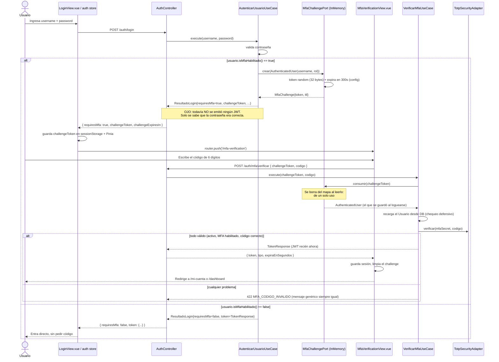
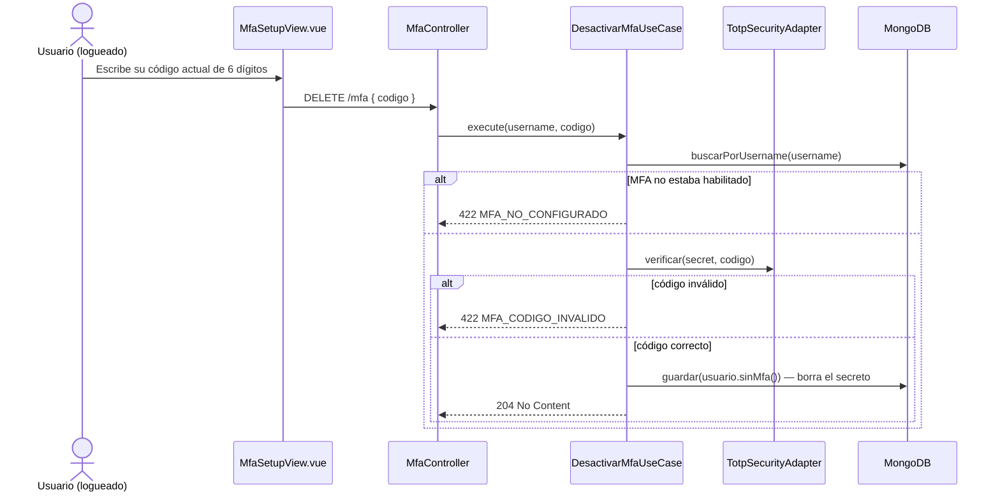

# MFA (segundo factor con Google Authenticator) — cómo funciona hoy en el proyecto

> Analizado directamente sobre el código de `Arquitectura-Clean` (backend) y `frontend`, rama `feature/auth-social-mfa`.

## 1. Explicación en términos simples

MFA (Multi-Factor Authentication / "verificación en dos pasos") significa que, además de tu contraseña, necesitas demostrar que tienes un segundo elemento en tu poder: en este caso, tu teléfono con la app **Google Authenticator** (o cualquier app compatible: Authy, Microsoft Authenticator, etc.), que genera un código de 6 dígitos que **cambia cada 30 segundos**.

El truco matemático detrás (llamado **TOTP**, *Time-based One-Time Password*) es simple de entender aunque suene técnico: tanto tu teléfono como el servidor conocen un mismo "secreto" (una clave aleatoria que se generó una sola vez, al activar MFA). Los dos, de forma independiente, calculan una fórmula que combina ese secreto con **la hora actual redondeada a bloques de 30 segundos**. Como ambos usan la misma fórmula, el mismo secreto y (aproximadamente) la misma hora, ambos llegan al mismo número de 6 dígitos sin necesidad de comunicarse entre sí en ese instante. Por eso funciona incluso con el teléfono en modo avión.

En este proyecto, el MFA tiene **dos partes separadas**:
- **Configurarlo** (una sola vez, ya logueado): generar el secreto, mostrar el QR, confirmarlo con un código.
- **Usarlo en cada login** (mientras esté activo): después de la contraseña, pedir el código de 6 dígitos antes de entregar la sesión.

## 2. Componentes involucrados

### Backend (`Arquitectura-Clean`)

| Capa | Archivo | Rol |
|---|---|---|
| Controller | `interfaceadapters/in/rest/controller/MfaController.java` | `/api/mfa/configurar`, `/api/mfa/activar`, `DELETE /api/mfa`, `/api/mfa/estado` |
| Controller | `interfaceadapters/in/rest/controller/AuthController.java` | `POST /api/auth/mfa/verificar` (verificación durante el login) |
| Caso de uso | `usecases/service/mfa/ConfigurarMfaUseCase.java` | Genera el secreto y el QR |
| Caso de uso | `usecases/service/mfa/ActivarMfaUseCase.java` | Confirma el secreto con un primer código válido |
| Caso de uso | `usecases/service/mfa/DesactivarMfaUseCase.java` | Apaga el MFA (requiere un código válido) |
| Caso de uso | `usecases/service/mfa/ObtenerEstadoMfaUseCase.java` | Devuelve si está habilitado o no |
| Caso de uso | `usecases/service/auth/AutenticarUsuarioUseCase.java` | Login con contraseña: crea el "desafío" MFA si corresponde |
| Caso de uso | `usecases/service/auth/VerificarMfaUseCase.java` | Verifica el código y recién ahí emite el JWT |
| Puerto | `usecases/port/out/security/MfaSecretGeneratorPort.java` | Generar el secreto Base32 |
| Puerto | `usecases/port/out/security/TotpVerifierPort.java` | Verificar un código contra un secreto |
| Puerto | `usecases/port/out/security/MfaChallengePort.java` | Crear/consumir el "desafío" temporal entre password y código |
| Puerto | `usecases/port/out/security/QrCodeGeneratorPort.java` | Generar la imagen QR |
| Adaptador | `interfaceadapters/out/security/mfa/TotpSecurityAdapter.java` | Implementa generación y verificación TOTP (HMAC-SHA1, RFC 6238) |
| Adaptador | `interfaceadapters/out/security/mfa/InMemoryMfaChallengeAdapter.java` | Guarda el desafío en memoria con expiración |
| Adaptador | `interfaceadapters/out/security/mfa/ZxingQrCodeAdapter.java` | Genera el PNG del QR (librería ZXing) |
| Modelo | `entities/model/Usuario.java` | Campos `mfaSecret`, `mfaHabilitado` |

### Frontend (`frontend/src`)

| Archivo | Rol |
|---|---|
| `views/MfaSetupView.vue` (ruta `/seguridad`) | Pantalla para activar/desactivar MFA, muestra el QR |
| `views/MfaVerificationView.vue` (ruta `/mfa-verification`) | Pide el código de 6 dígitos durante el login |
| `stores/auth.ts` | `login()` detecta `requiresMfa`, `verifyMfa()` canjea el código por el JWT |
| `router/index.ts` | Guarda de ruta: no se puede entrar a `/mfa-verification` sin un desafío activo (`meta.mfa`) |

## 3. Flujo paso a paso (con diagramas)

### 3.1 Activar MFA por primera vez

```mermaid
sequenceDiagram
    actor U as Usuario (ya logueado)
    participant FE as MfaSetupView.vue
    participant BE as MfaController
    participant CFG as ConfigurarMfaUseCase
    participant TOTP as TotpSecurityAdapter
    participant QR as ZxingQrCodeAdapter
    participant ACT as ActivarMfaUseCase
    participant DB as MongoDB

    U->>FE: Entra a /seguridad
    FE->>BE: GET /mfa/estado
    BE-->>FE: { habilitado: false }
    U->>FE: Click "Activar MFA"
    FE->>BE: POST /mfa/configurar
    BE->>CFG: execute(username)
    CFG->>DB: buscarPorUsername(username)
    CFG->>TOTP: generar() → 20 bytes aleatorios → Base32
    CFG->>DB: guardar(usuario.conMfa(secret, habilitado=false))
    Note over CFG,DB: El secreto ya queda guardado<br/>aunque todavía no esté confirmado
    CFG->>CFG: arma otpauth://totp/Andina%20Seguros:username?secret=...&issuer=Andina%20Seguros&algorithm=SHA1&digits=6&period=30
    CFG->>QR: generarDataUri(otpauthUri)
    QR-->>CFG: "data:image/png;base64,..."
    CFG-->>BE: { secret, otpauthUri, qrCodeDataUri }
    BE-->>FE: MfaSetupResponse
    FE-->>U: Muestra el QR + la clave manual
    U->>U: Escanea el QR con Google Authenticator
    U->>FE: Escribe el código de 6 dígitos que le muestra la app
    FE->>BE: POST /mfa/activar { codigo }
    BE->>ACT: execute(username, codigo)
    ACT->>DB: buscarPorUsername(username)
    ACT->>TOTP: verificar(secret, codigo)
    alt código correcto
        ACT->>DB: guardar(usuario.conMfa(secret, habilitado=true))
        ACT-->>BE: 204 No Content
        BE-->>FE: OK
        FE-->>U: "MFA habilitado correctamente"
    else código incorrecto
        ACT-->>BE: 422 MFA_CODIGO_INVALIDO
    end
```

### 3.2 Verificación de MFA durante el login normal



### 3.3 Desactivar MFA



### 3.4 Cómo se calcula el código TOTP (detalle técnico del algoritmo)

`TotpSecurityAdapter` implementa RFC 6238 "a mano" (sin librería externa):

1. **Generar el secreto** (`generar()`): 20 bytes (160 bits) de `SecureRandom`, codificados en **Base32** (el alfabeto estándar `A-Z2-7`) — es el formato que todas las apps de autenticación esperan al escanear o tipear manualmente.
2. **Calcular el "contador"**: `System.currentTimeMillis() / 30_000` — es decir, cuántos bloques de 30 segundos han pasado desde 1970. Este número cambia una vez cada 30 segundos, y es el mismo número (aproximadamente) tanto en el teléfono como en el servidor si ambos relojes están razonablemente sincronizados.
3. **HMAC-SHA1**: se firma ese contador (como 8 bytes) usando el secreto como clave.
4. **"Truncamiento dinámico"**: se toman 4 bytes específicos del resultado del HMAC (elegidos por los últimos 4 bits del propio hash, para no ser predecibles) y se convierten en un número.
5. **Módulo 1.000.000**: para quedarse solo con los 6 dígitos finales, rellenando con ceros a la izquierda si hace falta (`String.format("%06d", ...)`).
6. **Tolerancia de reloj**: en la verificación (`verificar`), en vez de comparar solo contra el contador actual, se prueba también con `counter - 1` y `counter + 1` — es decir, se acepta el código válido de **hasta 30 segundos antes o después**, dando una ventana total de ~90 segundos para absorber pequeños desfaces de reloj entre el teléfono y el servidor.

Este es exactamente el mismo algoritmo que usan Google Authenticator, Authy, etc., por eso son compatibles entre sí sin acuerdos especiales — es un estándar abierto.

## 4. Configuración necesaria

| Variable | Uso | Valor por defecto |
|---|---|---|
| `MFA_CHALLENGE_EXPIRATION_SECONDS` (`app.mfa.challenge-expiration-seconds`) | Cuánto tiempo es válido el `challengeToken` entre ingresar la contraseña y escribir el código | `300` (5 minutos) |

No hay ninguna otra configuración externa: el secreto TOTP es autogenerado por usuario y el algoritmo (SHA1, 6 dígitos, 30 segundos) está hardcodeado tanto en el backend (`ConfigurarMfaUseCase`) como implícito en `TotpSecurityAdapter` — coinciden entre sí, así que no hay riesgo de desalineación ahí.

## 5. Códigos de error y su HTTP status

| Código | HTTP | Origen | Cuándo ocurre |
|---|---|---|---|
| `MFA_YA_HABILITADO` | 422 | `ConfigurarMfaUseCase` | Se pide configurar MFA cuando ya está activo |
| `MFA_NO_CONFIGURADO` | 422 | `ActivarMfaUseCase` / `DesactivarMfaUseCase` | Se intenta activar/desactivar sin haber configurado un secreto antes |
| `MFA_CODIGO_INVALIDO` | 422 | `ActivarMfaUseCase` / `DesactivarMfaUseCase` / `VerificarMfaUseCase` | El código de 6 dígitos no coincide (o el usuario/estado no es válido, en el caso del login) |
| `MFA_DESAFIO_INVALIDO` | 422 | `InMemoryMfaChallengeAdapter` | El `challengeToken` no existe o ya fue usado |
| `MFA_DESAFIO_EXPIRADO` | 422 | `InMemoryMfaChallengeAdapter` | El `challengeToken` superó los 300s por defecto |
| `USUARIO_NO_ENCONTRADO` | 422 | `ConfigurarMfaUseCase` / `ObtenerEstadoMfaUseCase` | El `Principal` del JWT ya no corresponde a un usuario existente |

## 6. Inconsistencias y posibles errores detectados

### 🔴 Alta severidad

**1. El MFA no es realmente obligatorio: solo protege el login con contraseña, no los logins sociales.** {#inconsistencia-cruzada-el-mfa-no-es-realmente-obligatorio}
`AutenticarUsuarioUseCase` (login con contraseña) es el **único** punto de entrada que consulta `MfaChallengePort` y bloquea la emisión del JWT hasta verificar el código. Tanto `AutenticarConGoogleUseCase` como `AutenticarConFacebookUseCase` emiten el JWT de forma directa sin mirar en ningún momento `usuario.isMfaHabilitado()`. Ver el detalle en [LOGIN-GOOGLE.md](./LOGIN-GOOGLE.md#6-inconsistencias-y-posibles-errores-detectados) y [LOGIN-FACEBOOK.md](./LOGIN-FACEBOOK.md#6-inconsistencias-y-posibles-errores-detectados).
**Impacto:** activar MFA da al usuario una falsa sensación de seguridad — si su cuenta también tiene un proveedor social vinculado, ese segundo factor puede evitarse por completo simplemente usando el botón de Google/Facebook en vez de la contraseña. Un atacante que solo controle la sesión de Google/Facebook de la víctima (sin conocer su contraseña ni tener su teléfono) puede entrar igual.

**2. No hay ningún límite de intentos (rate limiting / lockout) al verificar códigos.**
Ni `VerificarMfaUseCase`, ni `ActivarMfaUseCase`, ni `DesactivarMfaUseCase` llevan un contador de intentos fallidos, ni bloquean temporalmente después de varios errores. Un código de 6 dígitos tiene 1.000.000 de combinaciones posibles; sin throttling, nada impide automatizar intentos contra `POST /auth/mfa/verificar` (que además está en la lista `permitAll` de `SecurityConfig`, es decir, es un endpoint público sin autenticación) durante toda la ventana de 5 minutos que dura el `challengeToken`. La mitigación real es solo el tiempo (300s de ventana × ~90s de código válido en cada instante), no un control activo de fuerza bruta.

### 🟠 Severidad media

**3. El secreto TOTP se guarda en la base de datos antes de confirmarse.**
`ConfigurarMfaUseCase.execute` hace `usuarios.guardar(usuario.conMfa(secret, false))` **inmediatamente**, antes de que el usuario haya demostrado (vía `/mfa/activar`) que efectivamente escaneó el QR y su app genera códigos válidos. Si el usuario abandona el proceso (cierra la pestaña, no escanea el QR), el secreto queda guardado indefinidamente en un estado "a medio confirmar" (`mfaHabilitado=false` pero `mfaSecret != null`). No es explotable por sí solo (mientras `mfaHabilitado` sea `false`, `VerificarMfaUseCase` nunca lo usa), pero es un dato sensible huérfano sin limpieza ni expiración.
Además, si el usuario llama a `/mfa/configurar` dos veces seguidas (por ejemplo, refrescando la página antes de escanear), el segundo secreto **reemplaza silenciosamente** al primero — cualquier QR ya escaneado en la primera llamada deja de servir, sin ningún aviso.

**4. Inconsistencia de HTTP status entre familias de errores de autenticación.**
Todos los errores de MFA (`MFA_CODIGO_INVALIDO`, `MFA_DESAFIO_INVALIDO`, `MFA_DESAFIO_EXPIRADO`, `MFA_YA_HABILITADO`, `MFA_NO_CONFIGURADO`) caen en la rama `default` del switch de `GlobalExceptionHandler` y devuelven **422 Unprocessable Entity**, mientras que fallos conceptualmente equivalentes en otros flujos de autenticación (`CREDENCIALES_INVALIDAS`, `GOOGLE_TOKEN_INVALIDO`) devuelven **401 Unauthorized**. No rompe nada funcionalmente (el frontend no distingue por status, solo por el campo `codigo`), pero es una inconsistencia de diseño de API: un código MFA incorrecto es, semánticamente, un fallo de autenticación (401), no un problema de "entidad no procesable" (422).

**5. `sessionStorage` para el `challengeToken` no sobrevive entre pestañas ni tras cerrar el navegador — pero tampoco hay problema de seguridad ahí, solo de UX.**
Si el usuario inicia el login en una pestaña, el `mfaChallenge` se guarda tanto en el estado de Pinia (memoria) como en `sessionStorage` (`stores/auth.ts`, acción `login`). Si refresca la página, Pinia se reinicializa leyendo `sessionStorage`, así que sí sobrevive a un refresh — pero si abre `/mfa-verification` en una pestaña nueva (o la comparte), no habrá challenge (cada pestaña tiene su propio `sessionStorage`) y el guard del router lo mandará de vuelta a `/login`. Es un detalle de experiencia, no de seguridad.

### 🟡 Severidad baja / notas de diseño

**6. El desafío MFA vive en memoria (`ConcurrentHashMap` en `InMemoryMfaChallengeAdapter`), igual que el `state` de Facebook y el ticket de login.** Un reinicio del backend a mitad del proceso de login invalida cualquier `challengeToken` pendiente (el usuario simplemente tiene que volver a loguearse desde cero, no es grave), pero en un despliegue con más de una instancia detrás de un balanceador, la petición de `/auth/login` y la de `/auth/mfa/verificar` podrían caer en instancias distintas, provocando `MFA_DESAFIO_INVALIDO` de forma intermitente y difícil de reproducir en soporte.

**7. Mensaje de error deliberadamente genérico en `VerificarMfaUseCase` — esto es correcto, no un bug, pero vale la pena documentarlo.** La línea `if (!usuario.isActivo() || !usuario.isMfaHabilitado() || !totp.verificar(...)) throw codigoInvalido();` colapsa tres causas muy distintas (cuenta desactivada, MFA ya no habilitado, o código realmente incorrecto) en el mismo mensaje `MFA_CODIGO_INVALIDO`. Es buena práctica de seguridad (no revela a un atacante *por qué* falló), pero puede confundir a un usuario legítimo cuya cuenta fue desactivada mientras tenía un challenge pendiente, ya que verá "código inválido" en vez de un mensaje que le diga que su cuenta está inactiva.

## 7. Recomendaciones (resumen)

- Extender el chequeo de `usuario.isMfaHabilitado()` a **todos** los caminos de login (Google y Facebook), no solo al de contraseña — esta es la corrección más importante de las tres, porque hoy el MFA es opcional en la práctica según el método de login que el atacante elija.
- Agregar un límite de intentos (por `challengeToken` o por IP) en `/auth/mfa/verificar`, y opcionalmente invalidar el `challengeToken` tras N intentos fallidos en vez de dejarlo expirar solo por tiempo.
- Marcar el secreto como "pendiente de confirmación" de forma explícita (o no persistirlo hasta la activación) para no dejar secretos huérfanos en la base de datos.
- Igualar el status HTTP de los errores de MFA a 401 si se quiere consistencia estricta con el resto de fallos de autenticación (cambio menor, de forma, no de fondo).

---
Ver también: [LOGIN-GOOGLE.md](./LOGIN-GOOGLE.md) · [LOGIN-FACEBOOK.md](./LOGIN-FACEBOOK.md)
