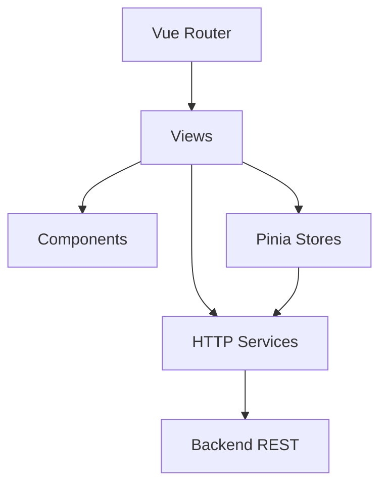
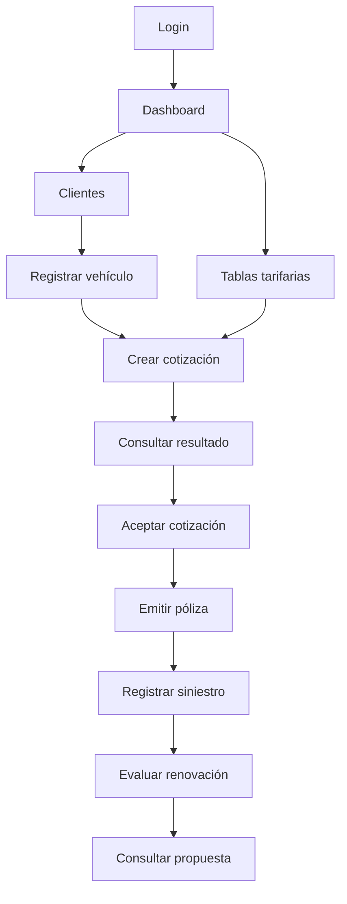
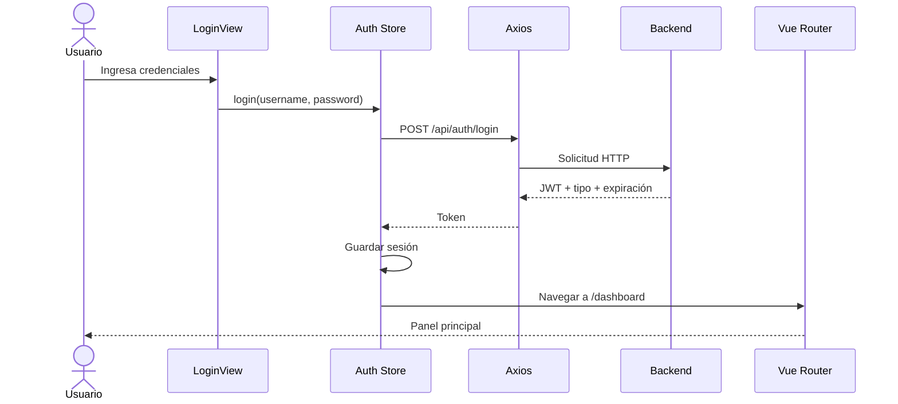
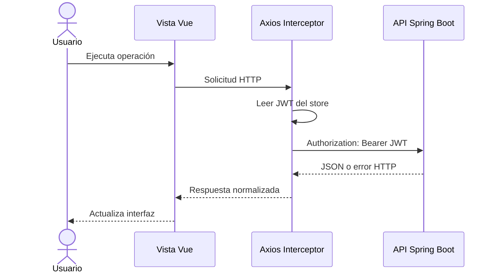
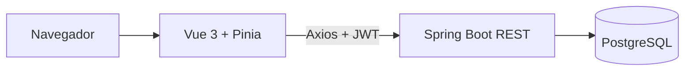

# Andina Seguros — Frontend Web

Aplicación web para operar el motor de tarificación y la gestión de pólizas de Andina Seguros. Está desarrollada con **Vue 3, TypeScript, Pinia, Vue Router, Axios y Vite**, y consume la API REST del backend Spring Boot.

## 1. Objetivo

Proporcionar una interfaz clara para completar el flujo funcional del seguro vehicular:

1. Autenticarse con JWT.
2. Gestionar clientes y vehículos.
3. Administrar tablas tarifarias.
4. Generar y aceptar cotizaciones.
5. Emitir y consultar pólizas.
6. Registrar siniestros.
7. Evaluar renovaciones.

## 2. Tecnologías

| Componente | Tecnología |
|---|---|
| Framework | Vue.js 3.5 |
| Lenguaje | TypeScript 5.7 |
| API de componentes | Composition API |
| Estado global | Pinia |
| Rutas | Vue Router |
| Cliente HTTP | Axios |
| Bundler | Vite 6 |
| Pruebas | Vitest |
| Servidor de producción | Nginx |
| Contenedores | Docker y Docker Compose |

## 3. Arquitectura del frontend



### Responsabilidades

- **Views:** pantallas funcionales de cada módulo.
- **Components:** piezas visuales reutilizables.
- **Stores:** sesión, token y rol del usuario.
- **Services:** configuración central de Axios e interceptores.
- **Router:** navegación, autenticación y autorización por rol.
- **Types:** contratos TypeScript compartidos.
- **Assets:** estilos globales y recursos visuales.

## 4. Estructura del proyecto

```text
andina-seguros-frontend/
├── src/
│   ├── assets/
│   │   └── main.css
│   ├── components/
│   │   ├── StatusBadge.vue
│   │   └── UiModal.vue
│   ├── layouts/
│   │   └── AppLayout.vue
│   ├── router/
│   │   └── index.ts
│   ├── services/
│   │   └── api.ts
│   ├── stores/
│   │   └── auth.ts
│   ├── types/
│   │   └── index.ts
│   ├── views/
│   │   ├── LoginView.vue
│   │   ├── DashboardView.vue
│   │   ├── ClientesView.vue
│   │   ├── TarifasView.vue
│   │   ├── CotizacionesView.vue
│   │   ├── PolizasView.vue
│   │   └── RenovacionesView.vue
│   ├── App.vue
│   └── main.ts
├── .env.example
├── Dockerfile
├── docker-compose.yml
├── nginx.conf
├── package.json
├── tsconfig.json
├── vite.config.ts
└── README.md
```

> Los archivos `.js` generados por TypeScript no son necesarios como código fuente. En un repositorio definitivo se recomienda conservar únicamente los `.ts` y `.vue` y excluir artefactos generados mediante `.gitignore`.

## 5. Módulos y funcionalidades

### 5.1 Autenticación

- Formulario de inicio de sesión.
- Consumo de `/api/auth/login`.
- Persistencia de token y rol.
- Inclusión automática de `Authorization: Bearer <token>`.
- Redirección al login cuando no existe sesión.
- Cierre de sesión.

### 5.2 Dashboard

- Pantalla inicial de navegación.
- Acceso rápido a los módulos.
- Resumen visual del sistema.

### 5.3 Clientes y vehículos

- Listado de clientes.
- Registro de cliente.
- Consulta de datos.
- Registro de vehículos asociados.
- Visualización de vehículos del cliente.

### 5.4 Tablas tarifarias

- Registro de tabla tarifaria.
- Prima base y prima mínima.
- Tipo y uso de vehículo.
- Vigencia y nota técnica.
- Configuración de factores de riesgo.
- Acceso restringido a roles `ADMIN` y `ACTUARIO` desde el router.

### 5.5 Cotizaciones

- Selección de cliente y vehículo.
- Solicitud de cálculo al backend.
- Visualización del resultado.
- Consulta de estado y vigencia.
- Aceptación de cotización.

### 5.6 Pólizas y siniestros

- Emisión de póliza a partir de cotización aceptada.
- Listado y consulta.
- Registro de siniestro.
- Visualización de siniestros asociados.
- Solicitud de evaluación de renovación.

### 5.7 Renovaciones

- Listado de propuestas.
- Visualización de prima anterior y nueva prima.
- Porcentaje de variación.
- Estado y motivo de la evaluación.

## 6. Rutas de la aplicación

| Ruta | Vista | Acceso |
|---|---|---|
| `/login` | Inicio de sesión | Pública |
| `/dashboard` | Panel principal | Autenticado |
| `/clientes` | Clientes y vehículos | Autenticado |
| `/tarifas` | Tablas tarifarias | `ADMIN`, `ACTUARIO` |
| `/cotizaciones` | Cotizaciones | Autenticado |
| `/polizas` | Pólizas y siniestros | Autenticado |
| `/renovaciones` | Renovaciones | Autenticado |

## 7. Flujo funcional implementado



### Flujo de autenticación



### Flujo de una solicitud protegida



## 8. Integración con el backend

Variable principal:

```env
VITE_API_URL=http://localhost:8080/api
```

Arquitectura de integración:



El backend debe estar disponible antes de utilizar funciones que consultan datos.

## 9. Requisitos

### Ejecución local

- Node.js 22 recomendado.
- npm 10 o superior.
- Backend ejecutándose en `http://localhost:8080`.

### Ejecución con contenedores

- Docker Desktop o Docker Engine.
- Docker Compose.

## 10. Configuración local

Instalar dependencias:

```bash
npm install
```

Crear archivo de entorno:

```bash
cp .env.example .env
```

Contenido:

```env
VITE_API_URL=http://localhost:8080/api
```

Iniciar desarrollo:

```bash
npm run dev
```

Abrir:

```text
http://localhost:5173
```

## 11. Scripts disponibles

| Comando | Función |
|---|---|
| `npm run dev` | Inicia Vite en modo desarrollo. |
| `npm run build` | Valida TypeScript y genera `dist/`. |
| `npm run preview` | Sirve localmente la compilación. |
| `npm run test` | Ejecuta pruebas con Vitest. |

## 12. Construcción de producción

```bash
npm ci
npm run build
```

El contenido optimizado se genera en:

```text
dist/
```

Probar la compilación:

```bash
npm run preview
```

## 13. Ejecución con Docker Compose

```bash
docker compose up --build -d
```

Abrir:

```text
http://localhost:5173
```

Ver logs:

```bash
docker compose logs -f frontend
```

Detener:

```bash
docker compose down
```

El contenedor realiza una compilación multi-stage con Node.js y sirve el resultado mediante Nginx.

## 14. Despliegue

### Construir imagen

```bash
docker build \
  --build-arg VITE_API_URL=https://api.midominio.pe/api \
  -t andina-seguros-frontend:1.0.0 .
```

### Ejecutar imagen

```bash
docker run --rm -p 8081:80 andina-seguros-frontend:1.0.0
```

Abrir:

```text
http://localhost:8081
```

### Consideración importante de Vite

`VITE_API_URL` se incorpora durante la compilación. Para cambiar la URL del backend en una imagen estática, debes reconstruir la imagen o implementar configuración dinámica en tiempo de ejecución.

### Plataformas compatibles

El frontend puede desplegarse en:

- Nginx en una VM.
- AWS S3 + CloudFront.
- Azure Static Web Apps.
- Netlify.
- Vercel.
- Cloudflare Pages.
- Contenedor en ECS, Kubernetes o App Service.

### Recomendaciones para producción

- Usar HTTPS.
- Configurar el dominio real del backend.
- Limitar CORS desde el backend.
- No registrar tokens ni datos personales en consola.
- Definir política de expiración de sesión.
- Agregar una página de error global.
- Incluir monitoreo de errores del navegador.
- Configurar cabeceras de seguridad en Nginx.
- Automatizar `npm ci`, pruebas y `npm run build` en CI/CD.

## 15. Nginx y rutas SPA

La configuración incluida utiliza:

```nginx
location / {
    try_files $uri $uri/ /index.html;
}
```

Esto permite recargar rutas como `/clientes` o `/polizas` sin recibir un error 404 del servidor.

## 16. Manejo de estado y seguridad

Pinia conserva:

- Token JWT.
- Rol del usuario.
- Estado de autenticación.

El router aplica guards para:

- Bloquear vistas privadas sin sesión.
- Evitar volver a `/login` cuando ya existe sesión.
- Restringir `/tarifas` a `ADMIN` y `ACTUARIO`.

La autorización definitiva siempre debe validarse en el backend. Ocultar una ruta en el frontend no sustituye los controles de Spring Security.

## 17. Pruebas recomendadas

El proyecto incluye Vitest como base. Se recomienda cubrir:

- Store de autenticación.
- Interceptor de Axios.
- Guards del router.
- Validación de formularios.
- Renderizado por estado.
- Manejo de errores 400, 401, 403, 404, 409 y 422.
- Flujos completos con Playwright o Cypress.

Ejecutar:

```bash
npm run test
```

## 18. Mejoras futuras

- Formularios con biblioteca de validación declarativa.
- Paginación, filtros y ordenamiento.
- Gestión detallada de permisos por componente.
- Dashboard con gráficos de primas y siniestralidad.
- Descarga de póliza PDF.
- Centro de notificaciones.
- Carga de evidencias de siniestro.
- Accesibilidad WCAG.
- Internacionalización.
- Pruebas E2E.
- Design system reusable.
- Renovación automática del JWT mediante refresh token.

## 19. Resolución de problemas

### El frontend no se conecta al backend

Verifica:

```env
VITE_API_URL=http://localhost:8080/api
```

Confirma que el backend responde:

```text
http://localhost:8080/swagger-ui.html
```

Reinicia Vite después de cambiar `.env`.

### Error CORS

El backend debe permitir el origen del frontend, por ejemplo:

```text
http://localhost:5173
```

### Error 401

- La sesión puede haber expirado.
- El token puede ser inválido.
- Vuelve a iniciar sesión.

### Error 403

El usuario está autenticado, pero no posee el rol requerido.

### Una ruta muestra 404 al recargar en producción

Verifica que Nginx o el hosting redirija las rutas desconocidas hacia `index.html`.

## 20. Licencia y propósito

Proyecto académico de referencia para demostrar una interfaz Vue.js integrada con un backend de Arquitectura Onion para seguros vehiculares.

## Solución al error `npm error Exit handler never called`

La imagen utiliza `node:20-bookworm-slim` y fija `npm@10.8.2` para evitar un fallo observado en npm 10.9.8 durante `npm ci`. También configura reintentos y tiempos de espera mayores para conexiones lentas.

Para reconstruir completamente la imagen:

```bash
docker compose down
docker builder prune -f
docker compose build --no-cache --progress=plain frontend
docker compose up -d
```

Si la descarga desde npm sigue siendo lenta, comprueba la conexión de Docker Desktop, desactiva temporalmente VPN/proxy y configura DNS públicos en Docker Desktop. El error no corresponde al código Vue cuando aparece antes de `npm run build`.

## Solución: `vue-tsc: not found` durante Docker build

La etapa de compilación necesita las dependencias de desarrollo (`vue-tsc`, `typescript`, `vite`). El Dockerfile fuerza su instalación mediante:

```dockerfile
ENV NODE_ENV=development
RUN npm ci --include=dev
```

Si Docker conserva una capa anterior incompleta, reconstruir sin caché:

```bash
docker compose down
docker builder prune -f
docker compose build --no-cache --progress=plain frontend
docker compose up -d
```

## Corrección de instalación en Docker con pnpm

El Dockerfile usa **pnpm 9.15.9 mediante Corepack** para evitar el error interno de npm `Exit handler never called`, presentado especialmente cuando Docker Desktop descarga paquetes con una conexión lenta o inestable.

Ejecuta los comandos **uno por uno** desde la carpeta que contiene `docker-compose.yml`:

```bash
docker compose down
docker builder prune -f
docker compose build --no-cache --progress=plain frontend
docker compose up -d
docker compose ps
```

No copies todos los comandos en una sola línea sin separarlos mediante `&&`.
